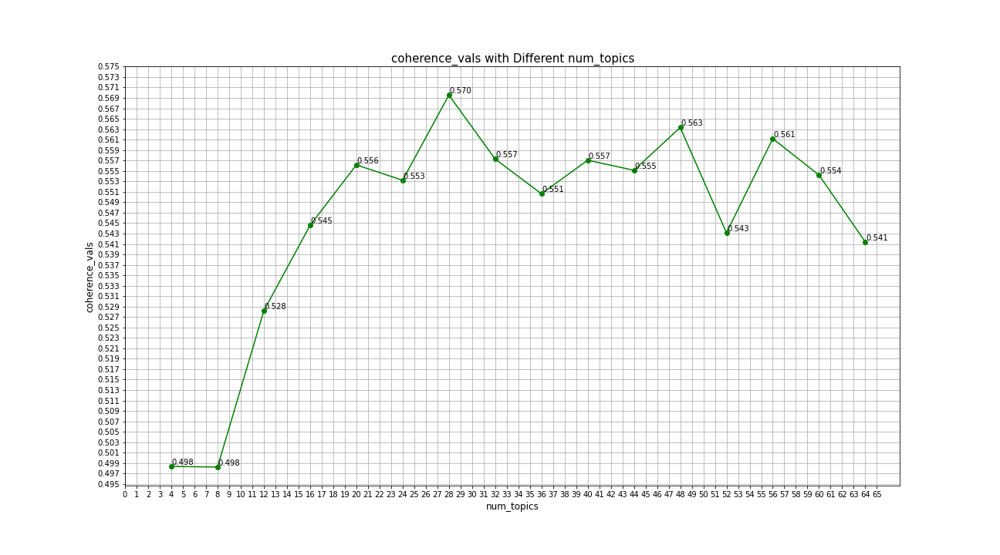
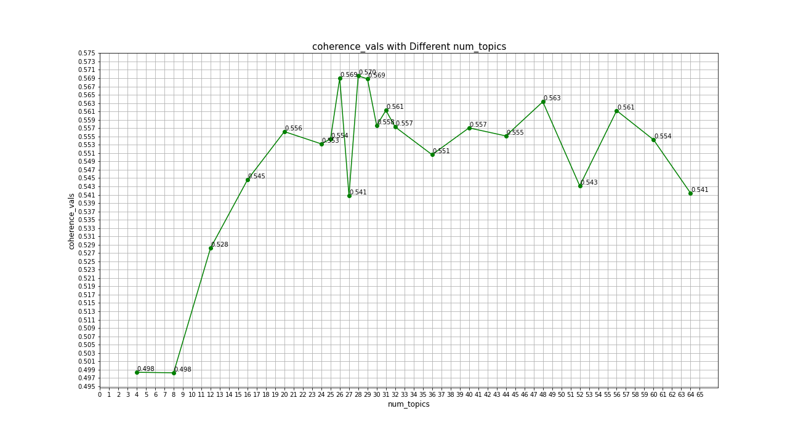
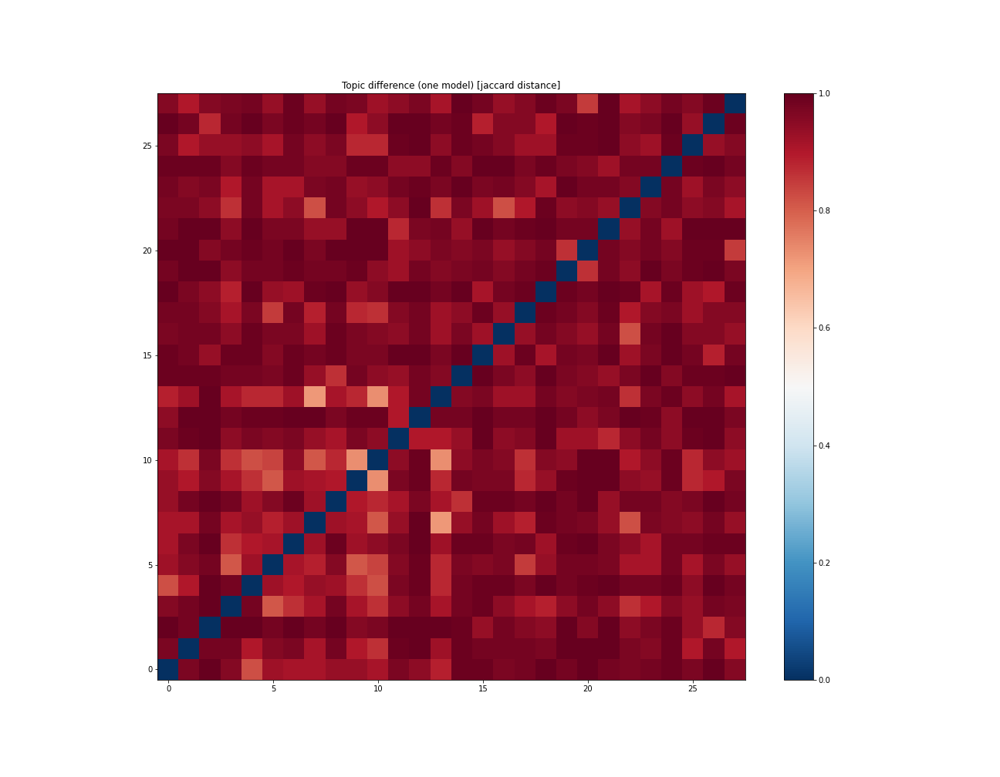

# Topic Modelling using Latent Derelict Allocation (LDA) for PubMed Central (pmc) Papers Related to COVID-19 and Other Corona Viruses

The CORD-19 dataset (https://www.kaggle.com/allen-institute-for-ai/CORD-19-research-challenge) containts a large collection of literature on coronaviruses that are made avilable for data mining. Part of the data is 85,000+ PMC papers- the project aims to classify the papers according to their topics in alignment with WHO's Research and Development Blueprint (https://www.who.int/blueprint/priority-diseases/key-action/Global_Research_Forum_FINAL_VERSION_for_web_14_feb_2020.pdf?ua=1) research topics to tackle the spread of COVID-19. These are: virus:natural history, transmission and diagnostics; animal and environmental research on the virus origin, and management measures at the human-animal interface, epidemiological studies; clinical characterization and management, infection prevention and control, including health care workers’ protection; candidate therapeutics R&D; candidate vaccines R&D; ethical considerations for research and; integrating social sciences in the outbreak response.

The concept of LDA was first applied by Blei, Ng and Jordan in 2003; in their paper they describe it as a generative probabilistic model for a text corpora. It uses a hierarchical (corpus, document and word level) Bayesian model where each document in a corpus is modeled as a random mixture of underlying set of topic probabilities [1]. 

Genisim is a popular open source library, for Python and other programming languages, that can be used for unsupervised topic modelling using Latent Dirichlet Allocation (LDA). The core estimation code for the LdaMulticore method is based on the onlineldavb.py script, by Hoffman, Blei, Bach: Online Learning for Latent Dirichlet Allocation, NIPS 2010 [2]. Gensim also has a module, models.wrappers.ldamallet, that allows both LDA model estimation from a training corpus and inference of topic distribution on new, unseen documents, using an (optimized version of) collapsed gibbs sampling from MALLET [3]. This project will apply both methods to model the topics.

In order to lower the computational cost, the data is first sampled for 40,000 pmc articles out of the 85,000+ avialable from the source. The sample is then processed by parsing the introduction, background, discussion and conclusion sections only. In order to accept the article into the corpus, there has to have an introduction and/or background section as well as a discussion and/or conclusion section. The latter step further lowered the number of papers to be included into the corpus into 19,664 papers. Once papers are parsed, the text is processed in Spacey's NLP library where it is tokenized, lemmatized and filtered to exclude stopwords, punctuation, standalone numbers, URL links and other words/characters deemed unuseful.

The code and technique used for the next steps follows the guidance given by Prabhakaran [4]. The corpus is then transformed into a bag-of-words (bow) vector, then gensim.models.ldamulticore class’ LdaMulticore method is used to model the topics. 16 different models are first created by varying the number of topics parameter num_topics using multiples of the number 4 from 4 to 64. In order to choose the best model and in turn the best number of topics to classify the topics into, the topic coherence score is calculated for each model using gensim.models.coherencemodel class. The topic coherence score calculation is based on Roeder, Both and Hinneburg’s 2015 [5]. The score quantifies the coherence of topics the documents were classified into, it ranges from 0 to 1, the higher the score the better the topic number choice is. The coherence score for the modelled topic numbers is shown in the plot below:

The highest score is 0.57 for 28 topics. To ensure that is the optimal topic number is chosen, the corpus is also modelled for 25, 26, 27, 29, 30 and 31. The resulting coherence score plot is shown below:

Topic number equal to 28 is still the topic with highest coherence score.

Another method to evaluate the modes is to compare topics correlation with each other within one model using Jacard distance. The plot below shows this relationship where the dark red cells indicate strongly decorrelated topics and dark blue cells indicate strongly correlated topics. In an ideal world, it is prefered to see different topics decorrelated between themselves (i.e. all dark red).

The plot shows a majority of the cells colored moderately dark to very dark red which is a good indication that the topic number 28 chosen is a good.

The table below shows the topic numbers and the top 5 paper titles and pmc ID number where the topic is most dominante.

|   Topic Number (n) |   Number of Documents | 5 Document Titles with Topic Number, n, Being Most Dominant                                                                                                                                                                                                                                                                                                                                                                                                                                                                                                                                                                                                                                                            | PMC Num.                                                               | Topic_Perc_Contrib                  |
|-------------------:|----------------------:|:-----------------------------------------------------------------------------------------------------------------------------------------------------------------------------------------------------------------------------------------------------------------------------------------------------------------------------------------------------------------------------------------------------------------------------------------------------------------------------------------------------------------------------------------------------------------------------------------------------------------------------------------------------------------------------------------------------------------------|:-----------------------------------------------------------------------|:------------------------------------|
|                  0 |                  1198 | A Rare Complication of Myocardial Infarction: Ventricular Septal Defect ; Minimally invasive beating heart technique for mitral valve surgery in patients with previous sternotomy and giant left ventricle ; COVID-19 Fears May Be Worse Than the Virus: A Case of Cardiogenic Shock Secondary to Post-Myocardial Infarction Ventricular Septum Rupture ; Abdominal compartment syndrome following posterior lumbar fusion in a patient with previous abdominal surgery ; Painless retrograde type A aortic dissection followed conservative treatment of type B aortic dissection: a case report                                                                                                                     | ['PMC7489448', 'PMC7268179', 'PMC7381854', 'PMC6786363', 'PMC6956508'] | [0.574, 0.554, 0.536, 0.535, 0.522] |
|                  1 |                  1134 | Development and application of one-step multiplex reverse transcription PCR for simultaneous detection of five diarrheal viruses in adult cattle ; Survey of WU and KI polyomaviruses, coronaviruses, respiratory syncytial virus and parechovirus in children under 5 years of age in Tehran, Iran ; A multiplex one-tube nested real time RT-PCR assay for simultaneous detection of respiratory syncytial virus, human rhinovirus and human metapneumovirus ; Comparison of two multiplex PCR assays for the detection of respiratory viral infections ; Etiology of respiratory disease in non-vaccinated, non-medicated calves in rearing herds                                                                   | ['PMC7086690', 'PMC7244825', 'PMC6208169', 'PMC7162222', 'PMC7130506'] | [0.531, 0.486, 0.469, 0.463, 0.461] |
|                  2 |                   923 | RNA sequence and secondary structural determinants in a minimal viral promoter that directs replicase recognition and initiation of genomic plus-strand RNA synthesis1 ; Cis-acting Regulatory Elements in the Potato Virus X 3′ Non-translated Region Differentially Affect Minus-strand and Plus-strand RNA Accumulation ; A long-distance RNA–RNA interaction plays an important role in programmed − 1 ribosomal frameshifting in the translation of p88 replicase protein of Red clover necrotic mosaic virus ; Sequence requirements for RNA strand transfer during nidovirus discontinuous subgenomic RNA synthesis ; Analysis of intermolecular RNA–RNA recombination by rubella virus                         | ['PMC7172556', 'PMC7126608', 'PMC7111920', 'PMC125340', 'PMC7126107']  | [0.613, 0.606, 0.604, 0.599, 0.577] |
|                  3 |                   399 | Endogenous Cell Repair of Chronic Demyelination ; SIRT1 Activating compounds reduce oxidative stress mediated neuronal loss in viral induced CNS demyelinating disease ; High viral loads despite absence of clinical and pathological findings in cats experimentally infected with feline coronavirus (FCoV) type I and in naturally FCoV-infected cats ; Extracellular matrix in the CNS induced by neuropathogenic viral infection ; Microglia Play a Major Role in Direct Viral-Induced Demyelination                                                                                                                                                                                                             | ['PMC1635791', 'PMC3892130', 'PMC7128724', 'PMC7168127', 'PMC3705805'] | [0.468, 0.447, 0.424, 0.424, 0.418] |
|                  4 |                  1130 | Lung Cancer with Diffuse Ground-glass Shadow in Two Lungs and Respiratory Failure ; 2019 Novel Coronavirus (COVID-19) Pneumonia with Hemoptysis as the Initial Symptom: CT and Clinical Features ; Clinical features and chest CT findings of three cases of 2019 novel coronavirus (COVID-2019) pneumonia ; Atypical Chest Computed Tomography Finding of Predominant Interstitial Thickening in a Patient with Coronavirus Disease 2019 (COVID-19) Pneumonia ; Imaging characteristics of initial chest computed tomography and clinical manifestations of patients with COVID-19 pneumonia                                                                                                                          | ['PMC4976580', 'PMC7183833', 'PMC7303668', 'PMC7520135', 'PMC7171599'] | [0.539, 0.503, 0.485, 0.484, 0.484] |
|                  5 |                   223 | Gefitinib sensitization of cisplatin-resistant wild-type EGFR non-small cell lung cancer cells ; Tumor Size as a Critical Prognostic Factor in T1-2 Stage Esophageal Cancer ; Interferon-Induced Transmembrane Protein 1 (IFITM1) Promotes Distant Metastasis of Small Cell Lung Cancer ; Potent delivery of an MMP inhibitor to the tumor microenvironment with thermosensitive liposomes for the suppression of metastasis and angiogenesis ; Tumor‐associated macrophages secrete CC‐chemokine ligand 2 and induce tamoxifen resistance by activating PI3K/Akt/mTOR in breast cancer                                                                                                                                | ['PMC7185832', 'PMC7448111', 'PMC7404048', 'PMC6799847', 'PMC6942430'] | [0.406, 0.373, 0.367, 0.346, 0.32]  |
|                  6 |                  1174 | Increased cytokine/chemokines in serum from asthmatic and non-asthmatic patients with viral respiratory infection ; Effect of Thymoquinone on Acute Kidney Injury Induced by Sepsis in BALB/c Mice ; Preventive Effect of Hochu-ekki-to on Lipopolysaccharide-Induced Acute Lung Injury in BALB/c Mice ; Pediatric Crohn's Disease and Multisystem Inflammatory Syndrome in Children (MIS-C) and COVID-19 Treated with Infliximab ; The α7 nicotinic acetylcholine receptor agonist, GTS-21, attenuates hyperoxia-induced acute inflammatory lung injury by alleviating the accumulation of HMGB1 in the airways and the circulation                                                                                   | ['PMC4177805', 'PMC7315249', 'PMC7101655', 'PMC7268863', 'PMC7322715'] | [0.461, 0.442, 0.441, 0.43, 0.427]  |
|                  7 |                   231 | Smoking Is Associated With COVID-19 Progression: A Meta-analysis ; The double-edged relationship between COVID-19 stress and smoking: Implications for smoking cessation ; Estimating the Impact of COVID-19 on the Individual Lifespan: A Conceptual Detour and an Empirical Shortcut ; The Missing Pieces of the COVID‐19 Puzzle ; Years of life lost associated with COVID-19 deaths in the United States                                                                                                                                                                                                                                                                                                           | ['PMC7239135', 'PMC7386200', 'PMC7430627', 'PMC7323433', 'PMC7499646'] | [0.379, 0.379, 0.339, 0.313, 0.312] |
|                  8 |                   779 | Elastomeric respirators are safer and more sustainable alternatives to disposable N95 masks during the coronavirus outbreak ; Face mask designs following novel Coronavirus ; Policies on the use of respiratory protection for hospital health workers to protect from coronavirus disease (COVID-19) ; Role of respirators in controlling the spread of novel coronavirus (COVID‐19) amongst dental healthcare providers: a review ; The role of isolation rooms, facemasks and intensified hand hygiene in the prevention of nosocomial COVID-19 transmission in a pulmonary clinical setting                                                                                                                       | ['PMC7369563', 'PMC7296280', 'PMC7174826', 'PMC7267233', 'PMC7376530'] | [0.41, 0.405, 0.404, 0.4, 0.4]      |
|                  9 |                   654 | Travel implications of emerging coronaviruses: SARS and MERS-CoV ; Lack of antibody-mediated cross-protection between SARS-CoV-2 and SARS-CoV infections ; Systematic Comparison of Two Animal-to-Human Transmitted Human Coronaviruses: SARS-CoV-2 and SARS-CoV ; Spike protein recognition of mammalian ACE2 predicts the host range and an optimized ACE2 for SARS-CoV-2 infection ; Coronavirus disease 2019 (COVID-19): current status and future perspectives                                                                                                                                                                                                                                                    | ['PMC7110592', 'PMC7372296', 'PMC7077191', 'PMC7102515', 'PMC7139247'] | [0.442, 0.423, 0.41, 0.409, 0.382]  |
|                 10 |                    99 | Virus recovery from idiopathic conjunctivitis of dogs ; Pneumococcal colonisation is an asymptomatic event in healthy adults using an experimental human colonisation model ; Ocular manifestations and clinical characteristics of 535 cases of COVID‐19 in Wuhan, China: a cross‐sectional study ; Sepsis due to Streptococcus pneumoniae associated with secondary hemophagocytic lymphohistiocytosis in a splenectomized patient for spherocytosis ; ACE2 and TMPRSS2 are expressed on the human ocular surface, suggesting susceptibility to SARS-CoV-2 infection                                                                                                                                                 | ['PMC7146800', 'PMC7064211', 'PMC7276826', 'PMC5515777', 'PMC7293510'] | [0.361, 0.284, 0.276, 0.267, 0.264] |
|                 11 |                   127 | Assessment of Preprint Policies of Top-Ranked Clinical Journals ; How fast is the peer-review process for orthopaedic publications related to the Covid-19 pandemic? ; Status of Editing and Publishing of Scholarly Journals by Academic Societies of Science and Technology in Korea ; COVID-19 Pandemic and Challenges for Socio-economic Issues, Healthcare and National Programs in India ; Getting a head start: turn-of-the-month submission effect for accepted papers in management journals                                                                                                                                                                                                                  | ['PMC7376388', 'PMC7486289', 'PMC7324265', 'PMC7261093', 'PMC7316350'] | [0.369, 0.323, 0.313, 0.294, 0.275] |
|                 12 |                  1133 | Embracing telemedicine into your otolaryngology practice amid the COVID-19 crisis: An invited commentary ; COVID-19 and medical emergencies in the dental practice ; Using National Early Warning Score (NEWS) 2 to help manage medical emergencies in the dental practice ; Development of a Palliative Care Toolkit for the COVID-19 Pandemic ; Augmenting the Disaster Healthcare Workforce                                                                                                                                                                                                                                                                                                                         | ['PMC7159874', 'PMC7348561', 'PMC7485207', 'PMC7255186', 'PMC7234719'] | [0.57, 0.515, 0.499, 0.481, 0.481]  |
|                 13 |                   225 | Respiratory outcomes of late preterm infants of mothers with early and late onset preeclampsia ; Extrauterine growth restriction in extremely preterm infants based on the Intergrowth-21st Project Preterm Postnatal Follow-up Study growth charts and the Fenton growth charts ; Maternal and neonatal characteristics and outcomes among COVID-19 infected women: An updated systematic review and meta-analysis ; Earlier re-initiation of enteral feeding after necrotizing enterocolitis decreases recurrence or stricture: a systematic review and meta-analysis ; Impact of multiple placental pathologies on neonatal death, bronchopulmonary dysplasia, and neurodevelopmental impairment in preterm infants | ['PMC7222144', 'PMC7480632', 'PMC7373687', 'PMC7368613', 'PMC7223700'] | [0.486, 0.468, 0.44, 0.435, 0.391]  |
|                 14 |                   792 | Leveraging investments in Ebola preparedness for COVID-19 in Sub-Saharan Africa ; Pilgrims and MERS-CoV: what’s the risk? ; Chinese travellers visiting friends and relatives – A review of infectious risks ; Healthcare Emergencies in Africa: The Case of Ebola in Nigeria ; Dengue fever in travellers: A challenge for European physicians                                                                                                                                                                                                                                                                                                                                                                        | ['PMC7236423', 'PMC4339294', 'PMC7110956', 'PMC7120945', 'PMC7127095'] | [0.51, 0.481, 0.476, 0.469, 0.466]  |
|                 15 |                   932 | Insight into the activity of SARS main protease: Molecular dynamics study of dimeric and monomeric form of enzyme ; Synthesis, antitubercular and anticancer activity of new Baylis–Hillman adduct-derived N-cinnamyl-substituted isatin derivatives ; Hemiacetal stabilization in a chymotrypsin inhibitor complex and the reactivity of the hydroxyl group of the catalytic serine residue of chymotrypsin ; Insights and Ideas Garnered from Marine Metabolites for Development of Dual-Function Acetylcholinesterase and Amyloid-β Aggregation Inhibitors ; A review on versatile applications of transition metal complexes incorporating Schiff bases                                                            | ['PMC7167853', 'PMC7080103', 'PMC7185751', 'PMC4012451', 'PMC7104041'] | [0.653, 0.647, 0.641, 0.639, 0.632] |
|                 16 |                   507 | Numerical study on the dispersion of airborne contaminants from an isolation room in the case of door opening ; Experimental study and performance analysis of solar-driven exhaust air thermoelectric heat pump recovery system ; Pedestrian level wind environment assessment around group of high-rise cross-shaped buildings: Effect of building shape, separation and orientation ; Experimental investigation of large-scale flow structures in an aircraft cabin mock-up ; Development and laboratory evaluation of a compact swirling aerosol sampler (SAS) for collection of atmospheric bioaerosols                                                                                                          | ['PMC7108432', 'PMC7126626', 'PMC7115803', 'PMC7455520', 'PMC7110794'] | [0.604, 0.598, 0.572, 0.568, 0.555] |
|                 17 |                   389 | Caligus madeirensis sp. nov. (Copepoda: Caligidae) Parasitic on Pompano, Trachinotus ovatus (Linnaeus, 1758), from Eastern Atlantic Waters, Surrounding the Madeira Archipelago, Portugal ; Bat Hunting and Bat–Human Interactions in Bangladeshi Villages: Implications for Zoonotic Disease Transmission and Bat Conservation ; Functional traits explain amphibian distribution in the Brazilian Atlantic Forest ; Trypanosoma teixeirae: A new species belonging to the T. cruzi clade causing trypanosomosis in an Australian little red flying fox (Pteropus scapulatus) ; Zoonotic Viruses and Conservation of Bats                                                                                             | ['PMC7526516', 'PMC5086320', 'PMC7166796', 'PMC7116988', 'PMC7122997'] | [0.543, 0.47, 0.468, 0.437, 0.437]  |
|                 18 |                  1418 | IFITM3 inhibits virus-triggered induction of type I interferon by mediating autophagosome-dependent degradation of IRF3 ; Porcine reproductive and respiratory syndrome virus infection induces endoplasmic reticulum stress, facilitates virus replication, and contributes to autophagy and apoptosis ; IRF1 Maintains Optimal Constitutive Expression of Antiviral Genes and Regulates the Early Antiviral Response ; Human Respiratory Syncytial Virus NS 1 Targets TRIM25 to Suppress RIG-I Ubiquitination and Subsequent RIG-I-Mediated Antiviral Signaling ; The Ubiquitin/Proteasome System Mediates Entry and Endosomal Trafficking of Kaposi's Sarcoma-Associated Herpesvirus in Endothelial Cells           | ['PMC6203713', 'PMC7403369', 'PMC6529937', 'PMC6316657', 'PMC3355089'] | [0.653, 0.648, 0.623, 0.621, 0.617] |
|                 19 |                   529 | Existence of solution and stability for the fractional order novel coronavirus (nCoV-2019) model ; Nonstandard Cayley Automatic Representations for Fundamental Groups of Torus Bundles over the Circle ; Aggregation Functions Transformed by 0 - 1 Valued Monotone Systems of Functions ; How to Prove that a Language Is Regular or Star-Free? ; On Proper Labellings of Graphs with Minimum Label Sum                                                                                                                                                                                                                                                                                                              | ['PMC7382328', 'PMC7206626', 'PMC7274760', 'PMC7206632', 'PMC7254921'] | [0.973, 0.968, 0.956, 0.954, 0.947] |
|                 20 |                   722 | Towards Fashion Recommendation: An AI System for Clothing Data Retrieval and Analysis ; Using FLOSS for Storing, Processing and Linking Corpus Data ; A Modeling Method for Systematic Architecture Reconstruction of Microservice-Based Software Systems ; Leveraging Schema Labels to Enhance Dataset Search ; Processing SPARQL Aggregate Queries with Web Preemption                                                                                                                                                                                                                                                                                                                                               | ['PMC7256565', 'PMC7198243', 'PMC7254549', 'PMC7148228', 'PMC7250599'] | [0.461, 0.458, 0.454, 0.453, 0.444] |
|                 21 |                   694 | The response of hotel performance to international tourism development and crisis events ; Investment Income of US Nonprofit Hospitals in 2017 ; Liberal trade policy and food insecurity across the income distribution: an observational analysis in 132 countries, 2014–17 ; Expected effects of the US tax reform on other countries: global and local survey evidence ; Framing consumer food demand responses in a viral pandemic                                                                                                                                                                                                                                                                                | ['PMC7115807', 'PMC7295319', 'PMC7375794', 'PMC7417858', 'PMC7267173'] | [0.603, 0.565, 0.558, 0.536, 0.532] |
|                 22 |                    74 | Soil bacterial communities in three rice-based cropping systems differing in productivity ; UK COVID-19 lockdown: 100 days of air pollution reduction? ; Ozone weekend effect in cities: Deep insights for urban air pollution control ; Convergence of carbon intensity in the Yangtze River Delta, China ; Increased ozone levels during the COVID-19 lockdown: Analysis for the city of Rio de Janeiro, Brazil                                                                                                                                                                                                                                                                                                      | ['PMC7300030', 'PMC7485429', 'PMC7483290', 'PMC7124204', 'PMC7263276'] | [0.381, 0.302, 0.298, 0.293, 0.29]  |
|                 23 |                   972 | Percutaneous Vaccination as an Effective Method of Delivery of MVA and MVA-Vectored Vaccines ; Impact of Preexisting Adenovirus Vector Immunity on Immunogenicity and Protection Conferred with an Adenovirus-Based H5N1 Influenza Vaccine ; An innovative approach to induce cross-protective immunity against porcine reproductive and respiratory syndrome virus in the lungs of pigs through adjuvanted nanotechnology-based vaccination ; Antibody Quality and Protection from Lethal Ebola Virus Challenge in Nonhuman Primates Immunized with Rabies Virus Based Bivalent Vaccine ; A recombinant DNA and vaccinia virus prime–boost regimen induces potent long-term T-cell responses to HCV in BALB/c mice    | ['PMC4760941', 'PMC3303828', 'PMC3969340', 'PMC3667758', 'PMC7115398'] | [0.532, 0.526, 0.522, 0.519, 0.517] |
|                 24 |                  1496 | The academic turn: Social media in higher education ; Factors Influencing Students’ Willingness to Choose Blended Learning in Higher Education ; Engineering Design Thinking and Making: Online Transdisciplinary Teaching and Learning in a Covid-19 Context ; Learning and Teaching Online During Covid-19: Experiences of Student Teachers in an Early Childhood Education Practicum ; Retired Educators’ Career Transition as a New Life Role of Underwriting Career Development in Botswana                                                                                                                                                                                                                       | ['PMC7270160', 'PMC7366438', 'PMC7333446', 'PMC7391473', 'PMC7476770'] | [0.594, 0.576, 0.56, 0.553, 0.545]  |
|                 25 |                   596 | Orthomyxoviruses: Structure of Antigens☆ ; Molecular detection and phylogenetic properties of isolated infectious bronchitis viruses from broilers in Ahvaz, southwest Iran, based on partial sequences of spike gene ; Enhanced pathogenicity of low-pathogenic H9N2 avian influenza virus after vaccination with infectious bronchitis live attenuated vaccine ; Genes Encoding the Virulence and the Antimicrobial Resistance in Enterotoxigenic and Shiga-toxigenic E. coli Isolated from Diarrheic Calves ; Phylogenetic and Pathotypic Characterization of Newcastle Disease Viruses Circulating in South China and Transmission in Different Birds                                                              | ['PMC7173616', 'PMC6198162', 'PMC6097558', 'PMC7354582', 'PMC4746259'] | [0.518, 0.461, 0.447, 0.437, 0.436] |
|                 26 |                   715 | Identification and Comparison of Receptor Binding Characteristics of the Spike Protein of Two Porcine Epidemic Diarrhea Virus Strains ; Receptor-bound porcine epidemic diarrhea virus spike protein cleaved by trypsin induces membrane fusion ; Structure of mouse coronavirus spike protein complexed with receptor reveals mechanism for viral entry ; Serine-scanning mutagenesis studies of the C-terminal heptad repeats in the SARS coronavirus S glycoprotein highlight the important role of the short helical region ; Biochemical Analysis of Coronavirus Spike Glycoprotein Conformational Intermediates during Membrane Fusion                                                                           | ['PMC4810246', 'PMC7087168', 'PMC7082060', 'PMC7111819', 'PMC6744234'] | [0.576, 0.545, 0.533, 0.52, 0.515]  |
|                 27 |                   399 | Performance of the TB-LAMP diagnostic assay in reference laboratories: Results from a multicentre study ; Direct Comparison of SARS-CoV-2 Analytical Limits of Detection across Seven Molecular Assays ; Simple, rapid, inexpensive platform for the diagnosis of malaria by loop mediated isothermal amplification (LAMP) ; SARS-CoV-2 sample-to-answer nucleic acid testing in a tertiary care emergency department: evaluation and utility ; Specific, simple and rapid detection of porcine circovirus type 2 using the loop-mediated isothermal amplification method                                                                                                                                              | ['PMC5890091', 'PMC7448668', 'PMC7094605', 'PMC7451096', 'PMC3315793'] | [0.476, 0.396, 0.374, 0.371, 0.364] |

References:
[1] Blei, D., Ng, A. and Jordan, M. (2003). Latent Dirichlet Allocation. In Journal of Machine Learning Research 3 (2003) 993-1022.
[2] Gensim: Topic modelling for humans. (2021, Jan 06). Retrieved from https://radimrehurek.com/gensim/models/ldamodel.html
[3] Gensim: Topic modelling for humans. (2021, Jan 06). Retrieved from https://radimrehurek.com/gensim/models/wrappers/ldamallet.html
[4] Prabhakaran, S. (Retrieved on 2021, Jan 06) Topic Modeling with Gensim (Python) . https://www.machinelearningplus.com/nlp/topic-modeling-gensim-python/
[5] Röder, M., Both, A., & Hinneburg, A. (2015, February). Exploring the space of topic coherence measures. In Proceedings of the eighth ACM international conference on Web search and data mining (pp. 399-408).
