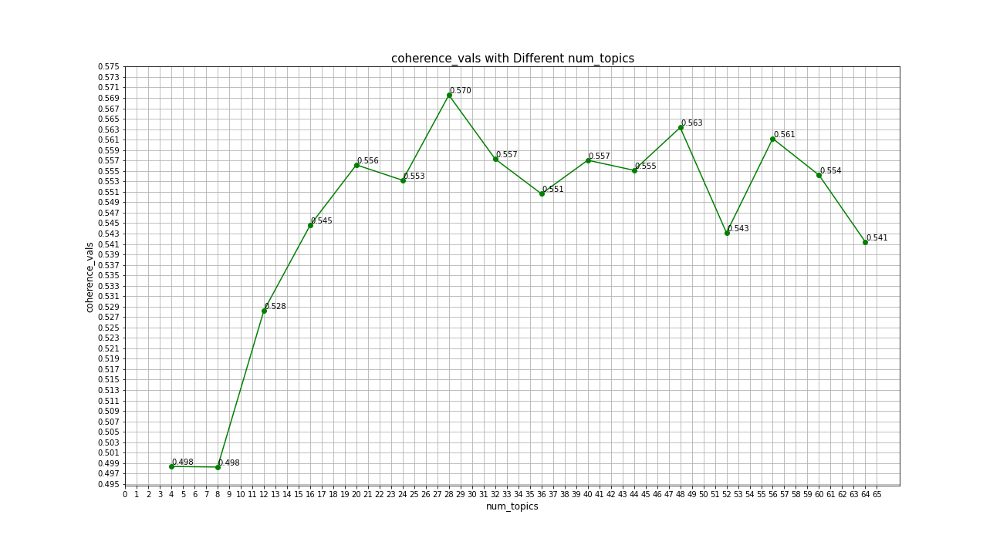
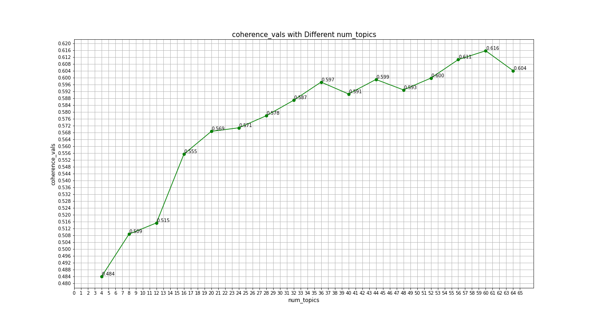

# Topic Modelling using Latent Derelict Allocation (LDA) for PubMed Central (pmc) Papers Related to COVID-19 and Other Corona Viruses

The CORD-19 dataset (https://www.kaggle.com/allen-institute-for-ai/CORD-19-research-challenge) containts a large collection of literature on coronaviruses that are made avilable for data mining. Part of the data is 85,000+ PMC papers- the project aims to classify the papers according to their topics in alignment with WHO's Research and Development Blueprint (https://www.who.int/blueprint/priority-diseases/key-action/Global_Research_Forum_FINAL_VERSION_for_web_14_feb_2020.pdf?ua=1) research topics to tackle the spread of COVID-19. These are: virus:natural history, transmission and diagnostics; animal and environmental research on the virus origin, and management measures at the human-animal interface, epidemiological studies; clinical characterization and management, infection prevention and control, including health care workers’ protection; candidate therapeutics R&D; candidate vaccines R&D; ethical considerations for research and; integrating social sciences in the outbreak response.

The concept of LDA was first applied by Blei, Ng and Jordan in 2003; in their paper they describe it as a generative probabilistic model for a text corpora. It uses a hierarchical (corpus, document and word level) Bayesian model where each document in a corpus is modeled as a random mixture of underlying set of topic probabilities [1]. 

Genisim is a popular open source library, for Python and other programming languages, that can be used for unsupervised topic modelling using Latent Dirichlet Allocation (LDA). The core estimation code for the LdaMulticore method is based on the onlineldavb.py script, by Hoffman, Blei, Bach: Online Learning for Latent Dirichlet Allocation, NIPS 2010 [2]. Gensim also has a module, models.wrappers.ldamallet, that allows both LDA model estimation using an (optimized version of) collapsed gibbs sampling from MALLET [3]. This project will apply both methods to model the topics.

In order to lower the computational cost, the data is first sampled for 40,000 pmc articles out of the 85,000+ avialable from the source. The sample is then processed by parsing the introduction, background, discussion and conclusion sections only. In order to accept the article into the corpus, there has to have an introduction and/or background section as well as a discussion and/or conclusion section. The latter step further lowered the number of papers to be included into the corpus into 19,664 papers. Once papers are parsed, the text is processed in Spacey's NLP library where it is tokenized, lemmatized and filtered to exclude stopwords, punctuation, standalone numbers, URL links and other words/characters deemed unuseful.

## Gensim LDA Core Module

The code and technique used for the next steps follows the guidance given by Prabhakaran [4]. The corpus is then transformed into a bag-of-words (bow) vector, then gensim.models.ldamulticore class’ LdaMulticore method is used to model the topics. 16 different models are first created by varying the number of topics parameter num_topics using multiples of the number 4 from 4 to 64. In order to choose the best model and in turn the best number of topics to classify the topics into, the topic coherence score is calculated for each model using gensim.models.coherencemodel class. The topic coherence score calculation is based on Roeder, Both and Hinneburg’s 2015 [5]. The score quantifies the coherence of topics the documents were classified into, it ranges from 0 to 1, the higher the score the better the topic number choice is. The coherence score for the modelled topic numbers is shown in the plot below:

The highest score is 0.57 for 28 topics. To ensure that is the optimal topic number is chosen, the corpus is also modelled for 25, 26, 27, 29, 30 and 31. The resulting coherence score plot is shown below:

Topic number equal to 28 is still the topic with highest coherence score.

Another method to evaluate the modes is to compare topics correlation with each other within one model using Jacard distance. The plot below shows this relationship where the dark red cells indicate strongly decorrelated topics and dark blue cells indicate strongly correlated topics. In an ideal world, it is prefered to see different topics decorrelated between themselves (i.e. all dark red).

The plot shows a majority of the cells colored moderately dark to very dark red which is a good indication that the topic number 28 chosen is a good.

The table below shows the topic numbers and the top 5 paper titles and pmc ID number where the topic is most dominante.

|   Topic Number (n) |   Number of Documents | 5 Document Titles with Topic Number, n, Being Most Dominant                                                                                                                                                                                                                                                                                                                                                                                                                                                                                                                                                                                                                                                            | PMC Num.                                                               | Topic_Perc_Contrib                  |
|-------------------:|----------------------:|:-----------------------------------------------------------------------------------------------------------------------------------------------------------------------------------------------------------------------------------------------------------------------------------------------------------------------------------------------------------------------------------------------------------------------------------------------------------------------------------------------------------------------------------------------------------------------------------------------------------------------------------------------------------------------------------------------------------------------|:-----------------------------------------------------------------------|:------------------------------------|
|                  0 |                  1198 | A Rare Complication of Myocardial Infarction: Ventricular Septal Defect ; Minimally invasive beating heart technique for mitral valve surgery in patients with previous sternotomy and giant left ventricle ; COVID-19 Fears May Be Worse Than the Virus: A Case of Cardiogenic Shock Secondary to Post-Myocardial Infarction Ventricular Septum Rupture ; Abdominal compartment syndrome following posterior lumbar fusion in a patient with previous abdominal surgery ; Painless retrograde type A aortic dissection followed conservative treatment of type B aortic dissection: a case report                                                                                                                     | ['PMC7489448', 'PMC7268179', 'PMC7381854', 'PMC6786363', 'PMC6956508'] | [0.574, 0.554, 0.536, 0.535, 0.522] |
|                  1 |                  1134 | Development and application of one-step multiplex reverse transcription PCR for simultaneous detection of five diarrheal viruses in adult cattle ; Survey of WU and KI polyomaviruses, coronaviruses, respiratory syncytial virus and parechovirus in children under 5 years of age in Tehran, Iran ; A multiplex one-tube nested real time RT-PCR assay for simultaneous detection of respiratory syncytial virus, human rhinovirus and human metapneumovirus ; Comparison of two multiplex PCR assays for the detection of respiratory viral infections ; Etiology of respiratory disease in non-vaccinated, non-medicated calves in rearing herds                                                                   | ['PMC7086690', 'PMC7244825', 'PMC6208169', 'PMC7162222', 'PMC7130506'] | [0.531, 0.486, 0.469, 0.463, 0.461] |
|                  2 |                   923 | RNA sequence and secondary structural determinants in a minimal viral promoter that directs replicase recognition and initiation of genomic plus-strand RNA synthesis1 ; Cis-acting Regulatory Elements in the Potato Virus X 3′ Non-translated Region Differentially Affect Minus-strand and Plus-strand RNA Accumulation ; A long-distance RNA–RNA interaction plays an important role in programmed − 1 ribosomal frameshifting in the translation of p88 replicase protein of Red clover necrotic mosaic virus ; Sequence requirements for RNA strand transfer during nidovirus discontinuous subgenomic RNA synthesis ; Analysis of intermolecular RNA–RNA recombination by rubella virus                         | ['PMC7172556', 'PMC7126608', 'PMC7111920', 'PMC125340', 'PMC7126107']  | [0.613, 0.606, 0.604, 0.599, 0.577] |
|                  3 |                   399 | Endogenous Cell Repair of Chronic Demyelination ; SIRT1 Activating compounds reduce oxidative stress mediated neuronal loss in viral induced CNS demyelinating disease ; High viral loads despite absence of clinical and pathological findings in cats experimentally infected with feline coronavirus (FCoV) type I and in naturally FCoV-infected cats ; Extracellular matrix in the CNS induced by neuropathogenic viral infection ; Microglia Play a Major Role in Direct Viral-Induced Demyelination                                                                                                                                                                                                             | ['PMC1635791', 'PMC3892130', 'PMC7128724', 'PMC7168127', 'PMC3705805'] | [0.468, 0.447, 0.424, 0.424, 0.418] |
|                  4 |                  1130 | Lung Cancer with Diffuse Ground-glass Shadow in Two Lungs and Respiratory Failure ; 2019 Novel Coronavirus (COVID-19) Pneumonia with Hemoptysis as the Initial Symptom: CT and Clinical Features ; Clinical features and chest CT findings of three cases of 2019 novel coronavirus (COVID-2019) pneumonia ; Atypical Chest Computed Tomography Finding of Predominant Interstitial Thickening in a Patient with Coronavirus Disease 2019 (COVID-19) Pneumonia ; Imaging characteristics of initial chest computed tomography and clinical manifestations of patients with COVID-19 pneumonia                                                                                                                          | ['PMC4976580', 'PMC7183833', 'PMC7303668', 'PMC7520135', 'PMC7171599'] | [0.539, 0.503, 0.485, 0.484, 0.484] |
|                  5 |                   223 | Gefitinib sensitization of cisplatin-resistant wild-type EGFR non-small cell lung cancer cells ; Tumor Size as a Critical Prognostic Factor in T1-2 Stage Esophageal Cancer ; Interferon-Induced Transmembrane Protein 1 (IFITM1) Promotes Distant Metastasis of Small Cell Lung Cancer ; Potent delivery of an MMP inhibitor to the tumor microenvironment with thermosensitive liposomes for the suppression of metastasis and angiogenesis ; Tumor‐associated macrophages secrete CC‐chemokine ligand 2 and induce tamoxifen resistance by activating PI3K/Akt/mTOR in breast cancer                                                                                                                                | ['PMC7185832', 'PMC7448111', 'PMC7404048', 'PMC6799847', 'PMC6942430'] | [0.406, 0.373, 0.367, 0.346, 0.32]  |
|                  6 |                  1174 | Increased cytokine/chemokines in serum from asthmatic and non-asthmatic patients with viral respiratory infection ; Effect of Thymoquinone on Acute Kidney Injury Induced by Sepsis in BALB/c Mice ; Preventive Effect of Hochu-ekki-to on Lipopolysaccharide-Induced Acute Lung Injury in BALB/c Mice ; Pediatric Crohn's Disease and Multisystem Inflammatory Syndrome in Children (MIS-C) and COVID-19 Treated with Infliximab ; The α7 nicotinic acetylcholine receptor agonist, GTS-21, attenuates hyperoxia-induced acute inflammatory lung injury by alleviating the accumulation of HMGB1 in the airways and the circulation                                                                                   | ['PMC4177805', 'PMC7315249', 'PMC7101655', 'PMC7268863', 'PMC7322715'] | [0.461, 0.442, 0.441, 0.43, 0.427]  |
|                  7 |                   231 | Smoking Is Associated With COVID-19 Progression: A Meta-analysis ; The double-edged relationship between COVID-19 stress and smoking: Implications for smoking cessation ; Estimating the Impact of COVID-19 on the Individual Lifespan: A Conceptual Detour and an Empirical Shortcut ; The Missing Pieces of the COVID‐19 Puzzle ; Years of life lost associated with COVID-19 deaths in the United States                                                                                                                                                                                                                                                                                                           | ['PMC7239135', 'PMC7386200', 'PMC7430627', 'PMC7323433', 'PMC7499646'] | [0.379, 0.379, 0.339, 0.313, 0.312] |
|                  8 |                   779 | Elastomeric respirators are safer and more sustainable alternatives to disposable N95 masks during the coronavirus outbreak ; Face mask designs following novel Coronavirus ; Policies on the use of respiratory protection for hospital health workers to protect from coronavirus disease (COVID-19) ; Role of respirators in controlling the spread of novel coronavirus (COVID‐19) amongst dental healthcare providers: a review ; The role of isolation rooms, facemasks and intensified hand hygiene in the prevention of nosocomial COVID-19 transmission in a pulmonary clinical setting                                                                                                                       | ['PMC7369563', 'PMC7296280', 'PMC7174826', 'PMC7267233', 'PMC7376530'] | [0.41, 0.405, 0.404, 0.4, 0.4]      |
|                  9 |                   654 | Travel implications of emerging coronaviruses: SARS and MERS-CoV ; Lack of antibody-mediated cross-protection between SARS-CoV-2 and SARS-CoV infections ; Systematic Comparison of Two Animal-to-Human Transmitted Human Coronaviruses: SARS-CoV-2 and SARS-CoV ; Spike protein recognition of mammalian ACE2 predicts the host range and an optimized ACE2 for SARS-CoV-2 infection ; Coronavirus disease 2019 (COVID-19): current status and future perspectives                                                                                                                                                                                                                                                    | ['PMC7110592', 'PMC7372296', 'PMC7077191', 'PMC7102515', 'PMC7139247'] | [0.442, 0.423, 0.41, 0.409, 0.382]  |
|                 10 |                    99 | Virus recovery from idiopathic conjunctivitis of dogs ; Pneumococcal colonisation is an asymptomatic event in healthy adults using an experimental human colonisation model ; Ocular manifestations and clinical characteristics of 535 cases of COVID‐19 in Wuhan, China: a cross‐sectional study ; Sepsis due to Streptococcus pneumoniae associated with secondary hemophagocytic lymphohistiocytosis in a splenectomized patient for spherocytosis ; ACE2 and TMPRSS2 are expressed on the human ocular surface, suggesting susceptibility to SARS-CoV-2 infection                                                                                                                                                 | ['PMC7146800', 'PMC7064211', 'PMC7276826', 'PMC5515777', 'PMC7293510'] | [0.361, 0.284, 0.276, 0.267, 0.264] |
|                 11 |                   127 | Assessment of Preprint Policies of Top-Ranked Clinical Journals ; How fast is the peer-review process for orthopaedic publications related to the Covid-19 pandemic? ; Status of Editing and Publishing of Scholarly Journals by Academic Societies of Science and Technology in Korea ; COVID-19 Pandemic and Challenges for Socio-economic Issues, Healthcare and National Programs in India ; Getting a head start: turn-of-the-month submission effect for accepted papers in management journals                                                                                                                                                                                                                  | ['PMC7376388', 'PMC7486289', 'PMC7324265', 'PMC7261093', 'PMC7316350'] | [0.369, 0.323, 0.313, 0.294, 0.275] |
|                 12 |                  1133 | Embracing telemedicine into your otolaryngology practice amid the COVID-19 crisis: An invited commentary ; COVID-19 and medical emergencies in the dental practice ; Using National Early Warning Score (NEWS) 2 to help manage medical emergencies in the dental practice ; Development of a Palliative Care Toolkit for the COVID-19 Pandemic ; Augmenting the Disaster Healthcare Workforce                                                                                                                                                                                                                                                                                                                         | ['PMC7159874', 'PMC7348561', 'PMC7485207', 'PMC7255186', 'PMC7234719'] | [0.57, 0.515, 0.499, 0.481, 0.481]  |
|                 13 |                   225 | Respiratory outcomes of late preterm infants of mothers with early and late onset preeclampsia ; Extrauterine growth restriction in extremely preterm infants based on the Intergrowth-21st Project Preterm Postnatal Follow-up Study growth charts and the Fenton growth charts ; Maternal and neonatal characteristics and outcomes among COVID-19 infected women: An updated systematic review and meta-analysis ; Earlier re-initiation of enteral feeding after necrotizing enterocolitis decreases recurrence or stricture: a systematic review and meta-analysis ; Impact of multiple placental pathologies on neonatal death, bronchopulmonary dysplasia, and neurodevelopmental impairment in preterm infants | ['PMC7222144', 'PMC7480632', 'PMC7373687', 'PMC7368613', 'PMC7223700'] | [0.486, 0.468, 0.44, 0.435, 0.391]  |
|                 14 |                   792 | Leveraging investments in Ebola preparedness for COVID-19 in Sub-Saharan Africa ; Pilgrims and MERS-CoV: what’s the risk? ; Chinese travellers visiting friends and relatives – A review of infectious risks ; Healthcare Emergencies in Africa: The Case of Ebola in Nigeria ; Dengue fever in travellers: A challenge for European physicians                                                                                                                                                                                                                                                                                                                                                                        | ['PMC7236423', 'PMC4339294', 'PMC7110956', 'PMC7120945', 'PMC7127095'] | [0.51, 0.481, 0.476, 0.469, 0.466]  |
|                 15 |                   932 | Insight into the activity of SARS main protease: Molecular dynamics study of dimeric and monomeric form of enzyme ; Synthesis, antitubercular and anticancer activity of new Baylis–Hillman adduct-derived N-cinnamyl-substituted isatin derivatives ; Hemiacetal stabilization in a chymotrypsin inhibitor complex and the reactivity of the hydroxyl group of the catalytic serine residue of chymotrypsin ; Insights and Ideas Garnered from Marine Metabolites for Development of Dual-Function Acetylcholinesterase and Amyloid-β Aggregation Inhibitors ; A review on versatile applications of transition metal complexes incorporating Schiff bases                                                            | ['PMC7167853', 'PMC7080103', 'PMC7185751', 'PMC4012451', 'PMC7104041'] | [0.653, 0.647, 0.641, 0.639, 0.632] |
|                 16 |                   507 | Numerical study on the dispersion of airborne contaminants from an isolation room in the case of door opening ; Experimental study and performance analysis of solar-driven exhaust air thermoelectric heat pump recovery system ; Pedestrian level wind environment assessment around group of high-rise cross-shaped buildings: Effect of building shape, separation and orientation ; Experimental investigation of large-scale flow structures in an aircraft cabin mock-up ; Development and laboratory evaluation of a compact swirling aerosol sampler (SAS) for collection of atmospheric bioaerosols                                                                                                          | ['PMC7108432', 'PMC7126626', 'PMC7115803', 'PMC7455520', 'PMC7110794'] | [0.604, 0.598, 0.572, 0.568, 0.555] |
|                 17 |                   389 | Caligus madeirensis sp. nov. (Copepoda: Caligidae) Parasitic on Pompano, Trachinotus ovatus (Linnaeus, 1758), from Eastern Atlantic Waters, Surrounding the Madeira Archipelago, Portugal ; Bat Hunting and Bat–Human Interactions in Bangladeshi Villages: Implications for Zoonotic Disease Transmission and Bat Conservation ; Functional traits explain amphibian distribution in the Brazilian Atlantic Forest ; Trypanosoma teixeirae: A new species belonging to the T. cruzi clade causing trypanosomosis in an Australian little red flying fox (Pteropus scapulatus) ; Zoonotic Viruses and Conservation of Bats                                                                                             | ['PMC7526516', 'PMC5086320', 'PMC7166796', 'PMC7116988', 'PMC7122997'] | [0.543, 0.47, 0.468, 0.437, 0.437]  |
|                 18 |                  1418 | IFITM3 inhibits virus-triggered induction of type I interferon by mediating autophagosome-dependent degradation of IRF3 ; Porcine reproductive and respiratory syndrome virus infection induces endoplasmic reticulum stress, facilitates virus replication, and contributes to autophagy and apoptosis ; IRF1 Maintains Optimal Constitutive Expression of Antiviral Genes and Regulates the Early Antiviral Response ; Human Respiratory Syncytial Virus NS 1 Targets TRIM25 to Suppress RIG-I Ubiquitination and Subsequent RIG-I-Mediated Antiviral Signaling ; The Ubiquitin/Proteasome System Mediates Entry and Endosomal Trafficking of Kaposi's Sarcoma-Associated Herpesvirus in Endothelial Cells           | ['PMC6203713', 'PMC7403369', 'PMC6529937', 'PMC6316657', 'PMC3355089'] | [0.653, 0.648, 0.623, 0.621, 0.617] |
|                 19 |                   529 | Existence of solution and stability for the fractional order novel coronavirus (nCoV-2019) model ; Nonstandard Cayley Automatic Representations for Fundamental Groups of Torus Bundles over the Circle ; Aggregation Functions Transformed by 0 - 1 Valued Monotone Systems of Functions ; How to Prove that a Language Is Regular or Star-Free? ; On Proper Labellings of Graphs with Minimum Label Sum                                                                                                                                                                                                                                                                                                              | ['PMC7382328', 'PMC7206626', 'PMC7274760', 'PMC7206632', 'PMC7254921'] | [0.973, 0.968, 0.956, 0.954, 0.947] |
|                 20 |                   722 | Towards Fashion Recommendation: An AI System for Clothing Data Retrieval and Analysis ; Using FLOSS for Storing, Processing and Linking Corpus Data ; A Modeling Method for Systematic Architecture Reconstruction of Microservice-Based Software Systems ; Leveraging Schema Labels to Enhance Dataset Search ; Processing SPARQL Aggregate Queries with Web Preemption                                                                                                                                                                                                                                                                                                                                               | ['PMC7256565', 'PMC7198243', 'PMC7254549', 'PMC7148228', 'PMC7250599'] | [0.461, 0.458, 0.454, 0.453, 0.444] |
|                 21 |                   694 | The response of hotel performance to international tourism development and crisis events ; Investment Income of US Nonprofit Hospitals in 2017 ; Liberal trade policy and food insecurity across the income distribution: an observational analysis in 132 countries, 2014–17 ; Expected effects of the US tax reform on other countries: global and local survey evidence ; Framing consumer food demand responses in a viral pandemic                                                                                                                                                                                                                                                                                | ['PMC7115807', 'PMC7295319', 'PMC7375794', 'PMC7417858', 'PMC7267173'] | [0.603, 0.565, 0.558, 0.536, 0.532] |
|                 22 |                    74 | Soil bacterial communities in three rice-based cropping systems differing in productivity ; UK COVID-19 lockdown: 100 days of air pollution reduction? ; Ozone weekend effect in cities: Deep insights for urban air pollution control ; Convergence of carbon intensity in the Yangtze River Delta, China ; Increased ozone levels during the COVID-19 lockdown: Analysis for the city of Rio de Janeiro, Brazil                                                                                                                                                                                                                                                                                                      | ['PMC7300030', 'PMC7485429', 'PMC7483290', 'PMC7124204', 'PMC7263276'] | [0.381, 0.302, 0.298, 0.293, 0.29]  |
|                 23 |                   972 | Percutaneous Vaccination as an Effective Method of Delivery of MVA and MVA-Vectored Vaccines ; Impact of Preexisting Adenovirus Vector Immunity on Immunogenicity and Protection Conferred with an Adenovirus-Based H5N1 Influenza Vaccine ; An innovative approach to induce cross-protective immunity against porcine reproductive and respiratory syndrome virus in the lungs of pigs through adjuvanted nanotechnology-based vaccination ; Antibody Quality and Protection from Lethal Ebola Virus Challenge in Nonhuman Primates Immunized with Rabies Virus Based Bivalent Vaccine ; A recombinant DNA and vaccinia virus prime–boost regimen induces potent long-term T-cell responses to HCV in BALB/c mice    | ['PMC4760941', 'PMC3303828', 'PMC3969340', 'PMC3667758', 'PMC7115398'] | [0.532, 0.526, 0.522, 0.519, 0.517] |
|                 24 |                  1496 | The academic turn: Social media in higher education ; Factors Influencing Students’ Willingness to Choose Blended Learning in Higher Education ; Engineering Design Thinking and Making: Online Transdisciplinary Teaching and Learning in a Covid-19 Context ; Learning and Teaching Online During Covid-19: Experiences of Student Teachers in an Early Childhood Education Practicum ; Retired Educators’ Career Transition as a New Life Role of Underwriting Career Development in Botswana                                                                                                                                                                                                                       | ['PMC7270160', 'PMC7366438', 'PMC7333446', 'PMC7391473', 'PMC7476770'] | [0.594, 0.576, 0.56, 0.553, 0.545]  |
|                 25 |                   596 | Orthomyxoviruses: Structure of Antigens☆ ; Molecular detection and phylogenetic properties of isolated infectious bronchitis viruses from broilers in Ahvaz, southwest Iran, based on partial sequences of spike gene ; Enhanced pathogenicity of low-pathogenic H9N2 avian influenza virus after vaccination with infectious bronchitis live attenuated vaccine ; Genes Encoding the Virulence and the Antimicrobial Resistance in Enterotoxigenic and Shiga-toxigenic E. coli Isolated from Diarrheic Calves ; Phylogenetic and Pathotypic Characterization of Newcastle Disease Viruses Circulating in South China and Transmission in Different Birds                                                              | ['PMC7173616', 'PMC6198162', 'PMC6097558', 'PMC7354582', 'PMC4746259'] | [0.518, 0.461, 0.447, 0.437, 0.436] |
|                 26 |                   715 | Identification and Comparison of Receptor Binding Characteristics of the Spike Protein of Two Porcine Epidemic Diarrhea Virus Strains ; Receptor-bound porcine epidemic diarrhea virus spike protein cleaved by trypsin induces membrane fusion ; Structure of mouse coronavirus spike protein complexed with receptor reveals mechanism for viral entry ; Serine-scanning mutagenesis studies of the C-terminal heptad repeats in the SARS coronavirus S glycoprotein highlight the important role of the short helical region ; Biochemical Analysis of Coronavirus Spike Glycoprotein Conformational Intermediates during Membrane Fusion                                                                           | ['PMC4810246', 'PMC7087168', 'PMC7082060', 'PMC7111819', 'PMC6744234'] | [0.576, 0.545, 0.533, 0.52, 0.515]  |
|                 27 |                   399 | Performance of the TB-LAMP diagnostic assay in reference laboratories: Results from a multicentre study ; Direct Comparison of SARS-CoV-2 Analytical Limits of Detection across Seven Molecular Assays ; Simple, rapid, inexpensive platform for the diagnosis of malaria by loop mediated isothermal amplification (LAMP) ; SARS-CoV-2 sample-to-answer nucleic acid testing in a tertiary care emergency department: evaluation and utility ; Specific, simple and rapid detection of porcine circovirus type 2 using the loop-mediated isothermal amplification method                                                                                                                                              | ['PMC5890091', 'PMC7448668', 'PMC7094605', 'PMC7451096', 'PMC3315793'] | [0.476, 0.396, 0.374, 0.371, 0.364] |

Following an assessment of the article titles and reading a sample of the abstracts of the papers attached to the topics, the following topic themes were infered or each topic number:

|  Topic Num |   Topic_Perc_Contrib | Keywords                                                                                                                                                                                    | Infered Topic Themes                                                              |
|-----------:|---------------------:|:--------------------------------------------------------------------------------------------------------------------------------------------------------------------------------------------|:----------------------------------------------------------------------------------|
|  0 |               0.5738 | patient, covid-19, risk, mortality, icu, outcome, complication, covid‐19, surgery, high                                                                                                     | Various surgical procedures complications and outcomes                            |
|  1 |               0.5308 | virus, sample, child, respiratory, pcr, detect, detection, viral, study, infection                                                                                                          | Testing and detecting for virus infections (PCR)                                  |
|  2 |               0.6127 | rna, sequence, gene, virus, genome, viral, dna, bat, region, mutation                                                                                                                       | Studies into viral RNA strands                                                    |
|  3 |               0.4681 | cell, tissue, type, study, mouse, effect, increase, cat, show, result                                                                                                                       | Effect of virus infections at the cellular level                                  |
|  4 |               0.539  | patient, clinical, respiratory, severe, pneumonia, symptom, covid-19, case, diagnosis, ct                                                                                                   | COVID-19: and resulting/interaction respiratory infection                         |
|  5 |               0.4056 | drug, treatment, study, cancer, effect, hiv, potential, target, agent, development                                                                                                          | Studies into Lung/Breast cancer                                                   |
|  6 |               0.4607 | inflammatory, cytokine, level, lung, disease, increase, treatment, inflammation, liver, blood                                                                                               | Lung injuries resulting from various other diseases                               |
|  7 |               0.3791 | population, study, age, high, rate, datum, factor, individual, year, risk                                                                                                                   | COVID-19: studies into risk factors which exacerbate its symptoms                 |
|  8 |               0.4098 | covid-19, case, pandemic, transmission, risk, contact, spread, measure, outbreak, confirm                                                                                                   | COVID-19: Transmission and spread prevention measures                             |
|  9 |               0.4416 | sars, cov-2, cov, coronavirus, mers, infection, virus, human, viral, syndrome                                                                                                               | Studies into other coronavirus infections (e.g. COV-2, SARS, MERS)                |
| 10 |               0.361  | infection, study, report, disease, case, cause, find, result, positive, associate                                                                                                           | No clear theme in the topic, related to different studies into viruses            |
| 11 |               0.3693 | time, new, pandemic, need, use, lockdown, health, number, measure, increase                                                                                                                 | Reviews and assessments into medical publications                                 |
| 12 |               0.5701 | care, health, medical, hospital, healthcare, need, practice, emergency, provide, service                                                                                                    | COVID-19: effect of the pandameic on medical practices                            |
| 13 |               0.486  | study, group, high, report, low, day, compare, adult, associate, include                                                                                                                    | Studies into obstetric procedures which includes complications from COVID-19      |
| 14 |               0.5097 | country, disease, outbreak, health, epidemic, case, public, china, infectious, surveillance                                                                                                 | Travel and spread of pandemics including COVID-19                                 |
| 15 |               0.6529 | activity, compound, show, fig, structure, interaction, figure, acid, inhibitor, bind                                                                                                        | Medical chemistry and biochemestry research                                       |
| 16 |               0.6037 | air, temperature, particle, water, flow, increase, environment, energy, condition, concentration                                                                                            | Studies into dispersion of airborne/aerosol particles                             |
| 17 |               0.5431 | specie, human, animal, host, study, pathogen, natural, p., population, bat                                                                                                                  | Viral transmission between humans and animals                                     |
| 18 |               0.6529 | cell, expression, protein, viral, ifn, pathway, replication, induce, gene, signal                                                                                                           | Cellular and molecular immunology                                                 |
| 19 |               0.9734 | , model, \usepackage{amsfont, \usepackage{amssymb, \usepackage{amsmath, \usepackage{wasysym, \usepackage{amsbsy, \usepackage{mathrsf, \usepackage{upgreek, \setlength{\oddsidemargin}{-69pt | Mathematical modelling which touch on COVID19 modelling                           |
| 20 |               0.4613 | model, datum, approach, base, system, process, method, network, set, propose                                                                                                                | Data engineering and science papers                                               |
| 21 |               0.6032 | policy, impact, economic, social, health, food, market, change, government, community                                                                                                       | Economic implications of panademics and other factors on various business sectors |
| 22 |               0.3812 | high, result, increase, different, level, show, pattern, observe, value, distribution                                                                                                       | COVID-19: Global effect on communities                                            |
| 23 |               0.5319 | vaccine, cell, response, antibody, immune, t, antigen, mouse, specific, immunity                                                                                                            | Vaccines                                                                          |
| 24 |               0.5944 | health, social, research, information, student, medium, participant, experience, mental, self                                                                                               | Effect of COVID-19 and other issues on social wellbeing of people                               |
| 25 |               0.5185 | virus, influenza, strain, isolate, human, pathogen, bacterial, bacteria, ibv, infection                                                                                             | Viral infections inflicting animals that may pass to humans or cause economic and social issues                 |
| 26 |               0.5755 | protein, virus, bind, n, domain, s, pedv, membrane, acid, peptide                                                                                                                           | Studies into virus' membranes, receptors, binding mechanisims and protiens               |
| 27 |               0.4756 | test, method, result, sample, time, base, use, sensitivity, develop, detection                                                                                                              | Testing, detection and diagnosis of viral infections (e.g. SARS-COV-2, Malaria, etc..." |

## Gensim LDA Mallet Module

Next step was to run LDA using Mallet, a java script to carry out LDA via gensim's wrapper for the same inital range of number of topics. This yeilded in the following coherence scores.

|   Topic Number (n) |   Number of Documents | 5 Document Titles with Topic Number, n, Being Most Dominant                                                                                                                                                                                                                                                                                                                                                                                                                                                                                                                                                                                                                                                                     | PMC Num.                                                               | Topic_Perc_Contrib                  |
|-------------------:|----------------------:|:--------------------------------------------------------------------------------------------------------------------------------------------------------------------------------------------------------------------------------------------------------------------------------------------------------------------------------------------------------------------------------------------------------------------------------------------------------------------------------------------------------------------------------------------------------------------------------------------------------------------------------------------------------------------------------------------------------------------------------|:-----------------------------------------------------------------------|:------------------------------------|
|                  0 |                   324 | α2-3- and α2-6- N-linked sialic acids allow efficient interaction of Newcastle Disease Virus with target cells ; An exploration of conditions proposed to trigger the Ebola virus glycoprotein for fusion ; Calu-3 cells are largely resistant to entry driven by filovirus glycoproteins and the entry defect can be rescued by directed expression of DC-SIGN or cathepsin L ; Direct Visualization of Ebola Virus Fusion Triggering in the Endocytic Pathway ; High-Mannose Specific Lectin and Its Recombinants from a Carrageenophyta Kappaphycus alvarezii Represent a Potent Anti-HIV Activity Through High-Affinity Binding to the Viral Envelope Glycoprotein gp120                                                    | ['PMC7088266', 'PMC6611598', 'PMC7112014', 'PMC4752599', 'PMC7088233'] | [0.78, 0.738, 0.725, 0.698, 0.687]  |
|                  1 |                   268 | Cis-acting Regulatory Elements in the Potato Virus X 3′ Non-translated Region Differentially Affect Minus-strand and Plus-strand RNA Accumulation ; A long-distance RNA–RNA interaction plays an important role in programmed − 1 ribosomal frameshifting in the translation of p88 replicase protein of Red clover necrotic mosaic virus ; Sequence requirements for RNA strand transfer during nidovirus discontinuous subgenomic RNA synthesis ; mRNA-Mediated Duplexes Play Dual Roles in the Regulation of Bidirectional Ribosomal Frameshifting ; The 3′-Terminal 55 Nucleotides of Bovine Coronavirus Defective Interfering RNA Harbor Cis-Acting Elements Required for Both Negative- and Positive-Strand RNA Synthesis | ['PMC7126608', 'PMC7111920', 'PMC125340', 'PMC6321510', 'PMC4031142']  | [0.891, 0.862, 0.847, 0.831, 0.819] |
|                  2 |                   336 | Maturation Pathways of Cross-Reactive HIV-1 Neutralizing Antibodies ; Conserved amino acids W423 and N424 in receptor-binding domain of SARS-CoV are potential targets for therapeutic monoclonal antibody ; The Antibody Germline/Maturation Hypothesis, Elicitation of Broadly Neutralizing Antibodies Against HIV-1 and Cord Blood IgM Repertoires ; Assessment of antibody responses against gp41 in HIV-1-infected patients using soluble gp41 fusion proteins and peptides derived from M group consensus envelope ; Divergent Peptide Presentations of HLA-A 30 Alleles Revealed by Structures With Pathogen Peptides                                                                                                    | ['PMC3185542', 'PMC7103409', 'PMC4147355', 'PMC2293309', 'PMC6664060'] | [0.616, 0.602, 0.59, 0.582, 0.57]   |
|                  3 |                   338 | The CC chemokine ligand 3 regulates CD11c+CD11b+CD8α− dendritic cell maturation and activation following viral infection of the central nervous system: implications for a role in T cell activation ; IL-15-independent antiviral function of primary and memory CD8+ T cells ; IL-15 independent maintenance of virus-specific CD8+ T cells in the CNS during chronic infection ; Exacerbation of Japanese Encephalitis by CD11chi Dendritic Cell Ablation Is Associated with an Imbalance in Regulatory Foxp3+ and IL-17+CD4+ Th17 Cells and in Ly-6Chi and Ly-6Clo Monocytes ; Memory T-cell competition for bone marrow seeding                                                                                            | ['PMC7111789', 'PMC7111818', 'PMC2679951', 'PMC5484650', 'PMC1782895'] | [0.827, 0.778, 0.763, 0.734, 0.728] |
|                  4 |                   353 | Efficacy and safety of early prone positioning combined with HFNC or NIV in moderate to severe ARDS: a multi-center prospective cohort study ; Neurally adjusted ventilatory assist preserves cerebral blood flow velocity in patients recovering from acute brain injury ; Peripheral perfusion index as a predictor of failed weaning from mechanical ventilation ; Assessment of the benefits of head-up preoxygenation using near-infrared spectroscopy with pulse oximetry in a swine model ; Initial emergency department mechanical ventilation strategies for COVID-19 hypoxemic respiratory failure and ARDS                                                                                                           | ['PMC6993481', 'PMC7223974', 'PMC7224046', 'PMC7223107', 'PMC7335247'] | [0.717, 0.716, 0.689, 0.683, 0.682] |
|                  5 |                   544 | Relevance Ranking Based on Query-Aware Context Analysis ; Joint Word and Entity Embeddings for Entity Retrieval from a Knowledge Graph ; To BERT or Not to BERT Dealing with Possible BERT Failures in an Entailment Task ; Semantics-Reconstructing Hashing for Cross-Modal Retrieval ; COVID-19 image classification using deep features and fractional-order marine predators algorithm                                                                                                                                                                                                                                                                                                                                      | ['PMC7148224', 'PMC7148220', 'PMC7274325', 'PMC7206300', 'PMC7506559'] | [0.779, 0.77, 0.768, 0.768, 0.76]   |
|                  6 |                   410 | Lopinavir-Ritonavir in SARS-CoV-2 Infection and Drug-Drug Interactions with Cardioactive Medications ; Durable Suppression and Low Rate of Virologic Failure 3 Years After Switch to Dolutegravir + Rilpivirine 2-Drug Regimen: 148-Week Results From the SWORD-1 and SWORD-2 Randomized Clinical Trials ; Colchicine in COVID-19: an Old Drug, New Use ; COVID-19 prevention and treatment: A critical analysis of chloroquine and hydroxychloroquine clinical pharmacology ; Antimalarial drugs inhibit the replication of SARS-CoV-2: an in vitro evaluation                                                                                                                                                                 | ['PMC7486594', 'PMC7446981', 'PMC7367785', 'PMC7470382', 'PMC7477610'] | [0.543, 0.512, 0.46, 0.458, 0.454]  |
|                  7 |                   596 | Global health activists’ lessons on building social movements for Health for All ; International Law and Public Health Policy ; State Capacity and Leadership in ASEAN and the EU ; Towards a theory of just transition: A neo-Gramscian understanding of how to shift development pathways to zero poverty and zero carbon ; Not Quite Right: Representations of Eastern Europeans in ECJ Discourse                                                                                                                                                                                                                                                                                                                            | ['PMC7338122', 'PMC7149572', 'PMC7121486', 'PMC7518974', 'PMC7283037'] | [0.802, 0.784, 0.756, 0.741, 0.737] |
|                  8 |                   240 | Overview of three influenza seasons in Georgia, 2014–2017 ; Virological and Epidemiological Situation in the Influenza Epidemic Seasons 2016/2017 and 2017/2018 in Poland ; Human infection with avian influenza A H6N1 virus: an epidemiological analysis ; Orthomyxoviruses: Structure of Antigens☆ ; Development and evaluation of a new real‐time RT‐PCR assay for detecting the latest H9N2 influenza viruses capable of causing human infection                                                                                                                                                                                                                                                                           | ['PMC6063423', 'PMC7120128', 'PMC7164810', 'PMC7173616', 'PMC6590187'] | [0.526, 0.511, 0.5, 0.479, 0.476]   |
|                  9 |                   136 | Permissiveness of human hepatoma cell lines for HCV infection ; Inhibitory effects of homoharringtonine on foot and mouth disease virus in vitro ; The cyclophilin inhibitor CRV431 inhibits liver HBV DNA and HBsAg in transgenic mice ; Daphne Genkwa Sieb. et Zucc. Water-Soluble Extracts Act on Enterovirus 71 by Inhibiting Viral Entry ; Epstein-Barr Virus Nuclear Antigen 1 Recruits Cyclophilin A to Facilitate the Replication of Viral DNA Genome                                                                                                                                                                                                                                                                   | ['PMC3317838', 'PMC7166808', 'PMC6557616', 'PMC3347322', 'PMC6923202'] | [0.512, 0.451, 0.447, 0.423, 0.417] |
|                 10 |                   387 | Experimental infection of gnotobiotic pigs with the cell-culture-adapted porcine deltacoronavirus strain OH-FD22 ; Isolation and characterization of a new porcine epidemic diarrhea virus variant that occurred in Korea in 2014 ; A Highly Pathogenic Strain of Porcine Deltacoronavirus Caused Watery Diarrhea in Newborn Piglets ; Pathogenicity study of Iranian genotype of avian infectious bronchitis virus (IR-1) ; Biological characterization and pathogenicity of a newly isolated Chinese highly virulent genotype GIIa porcine epidemic diarrhea virus strain                                                                                                                                                     | ['PMC7087098', 'PMC5799402', 'PMC6178105', 'PMC5413309', 'PMC7086859'] | [0.744, 0.679, 0.677, 0.658, 0.653] |
|                 11 |                   353 | P200 family protein IFI204 negatively regulates type I interferon responses by targeting IRF7 in nucleus ; Vaccinia Virus Protein C6 Is a Virulence Factor that Binds TBK-1 Adaptor Proteins and Inhibits Activation of IRF3 and IRF7 ; Porcine reproductive and respiratory syndrome virus (PRRSV) suppresses interferon-β production by interfering with the RIG-I signaling pathway ; Human Respiratory Syncytial Virus NS 1 Targets TRIM25 to Suppress RIG-I Ubiquitination and Subsequent RIG-I-Mediated Antiviral Signaling ; IRF1 Maintains Optimal Constitutive Expression of Antiviral Genes and Regulates the Early Antiviral Response                                                                                | ['PMC6818788', 'PMC3169548', 'PMC7112510', 'PMC6316657', 'PMC6529937'] | [0.756, 0.73, 0.73, 0.728, 0.723]   |
|                 12 |                   157 | The biology of unconventional invasion of Duffy-negative reticulocytes by Plasmodium vivax and its implication in malaria epidemiology and public health ; ast and current biological factors affecting malaria in the low transmission setting of Botswana: A review ; Differential contribution of Anopheles coustani and Anopheles arabiensis to the transmission of Plasmodium falciparum and Plasmodium vivax in two neighbouring villages of Madagascar ; Sequential Adaptive Mutations Enhance Efficient Vector Switching by Chikungunya Virus and Its Epidemic Emergence ; Sexual forms obtained in a continuous in vitro cultured Colombian strain of Plasmodium falciparum (FCB2)                                     | ['PMC7443611', 'PMC7354381', 'PMC7447585', 'PMC3234230', 'PMC6998264'] | [0.522, 0.495, 0.494, 0.471, 0.44]  |
|                 13 |                   199 | Influence of supercritical water treatment on heavy metals in medical waste incinerator fly ash ; Removal of carbon constituents from hospital solid waste incinerator fly ash by column flotation ; Thermodynamic modelling of solubility and preferential solvation for ribavirin (II) in co-solvent mixtures of (methanol, n-propanol, acetonitrile or 1,4-dioxane) + water ; Metabolite identification of arbidol in human urine by the study of CID fragmentation pathways using HPLC coupled with ion trap mass spectrometry ; Co-transesterification of waste cooking oil, algal oil and dimethyl carbonate over sustainable nanoparticle catalysts                                                                      | ['PMC7115779', 'PMC7127196', 'PMC7126742', 'PMC7166481', 'PMC7494454'] | [0.74, 0.699, 0.685, 0.668, 0.655]  |
|                 14 |                   445 | Critical behavior of a two-step contagion model with multiple seeds ; Relevance of backtracking paths in recurrent-state epidemic spreading on networks ; Impact of the infectious period on epidemics ; Generality of endemic prevalence formulae ; Stochastic epidemic dynamics on extremely heterogeneous networks                                                                                                                                                                                                                                                                                                                                                                                                           | ['PMC7217524', 'PMC7217544', 'PMC7217532', 'PMC7094683', 'PMC7226849'] | [0.841, 0.821, 0.811, 0.798, 0.78]  |
|                 15 |                   324 | Novel coronavirus disease (COVID-19) in children ; Comprehensive overview of COVID‐19 based on current evidence ; Evolution of severe acute respiratory syndrome coronavirus 2 (SARS-CoV-2) as coronavirus disease 2019 (COVID-19) pandemic: A global health emergency ; COVID-19 in Italy: did the virus run on an ancient Roman road? ; Covid-19 pandemic and food: Present knowledge, risks, consumers fears and safety                                                                                                                                                                                                                                                                                                      | ['PMC7195991', 'PMC7267400', 'PMC7190497', 'PMC7539755', 'PMC7480472'] | [0.468, 0.41, 0.382, 0.38, 0.369]   |
|                 16 |                   156 | fault: A Python Embedded Domain-Specific Language for Metaprogramming Portable Hardware Verification Components ; Towards Predictive Maintenance for Flexible Manufacturing Using FIWARE ; Combining Two Modelling Approaches: GQM and KAOS in an Open Source Project ; .NET Runtime and Tools for Tizen Operating System ; Visual Self-healing Modelling for Reliable Internet-of-Things Systems                                                                                                                                                                                                                                                                                                                               | ['PMC7363199', 'PMC7225515', 'PMC7198251', 'PMC7198257', 'PMC7302539'] | [0.574, 0.524, 0.475, 0.445, 0.443] |
|                 17 |                   471 | Comparison of the conventional multiplex RT–PCR, real time RT–PCR and Luminex xTAG® RVP fast assay for the detection of respiratory viruses ; Simultaneous and visual detection of infectious bronchitis virus and Newcastle disease virus by multiple LAMP and lateral flow dipstick ; Development of a multiplex isothermal amplification molecular diagnosis method for on-site diagnosis of influenza ; Development of a recombinase polymerase amplification combined with lateral-flow dipstick assay for detection of bovine ephemeral fever virus ; Method for the elucidation of LAMP products captured on lateral flow strips in a point of care test for HPV 16                                                      | ['PMC7166673', 'PMC7107193', 'PMC7485819', 'PMC7126596', 'PMC7266737'] | [0.667, 0.662, 0.654, 0.652, 0.651] |
|                 18 |                   311 | Viral Diversity, Prey Preference, and Bartonella Prevalence in Desmodus rotundus in Guatemala ; Genetic diversity and cross-species transmission of kobuviruses in Vietnam ; Identification of an Unclassified Paramyxovirus in Coleura afra: A Potential Case of Host Specificity ; New insights into the evolution of the Trypanosoma cruzi clade provided by a new trypanosome species tightly linked to Neotropical Pteronotus bats and related to an Australian lineage of trypanosomes ; Discovery of a highly divergent hepadnavirus in shrews from China                                                                                                                                                                | ['PMC5164864', 'PMC5810437', 'PMC4281239', 'PMC4690318', 'PMC7172195'] | [0.67, 0.663, 0.659, 0.647, 0.642]  |
|                 19 |                   207 | Novel halogenated 3-deazapurine, 7-deazapurine and alkylated 9-deazapurine derivatives of l-ascorbic or imino-l-ascorbic acid: Synthesis, antitumour and antiviral activity evaluations ; Synthesis of N-methyl-d-ribopyranuronamide nucleosides ; The evaluation of 1-tetralone and 4-chromanone derivatives as inhibitors of monoamine oxidase ; Stereoselective synthesis of trans-dihydronarciclasine derivatives containing a 1,4-benzodioxane moiety ; Synthesis, antitubercular and anticancer activity of new Baylis–Hillman adduct-derived N-cinnamyl-substituted isatin derivatives                                                                                                                                   | ['PMC7125971', 'PMC7126205', 'PMC7512223', 'PMC7087796', 'PMC7080103'] | [0.84, 0.818, 0.81, 0.804, 0.798]   |
|                 20 |                   485 | Takotsubo cardiomyopathy in COVID-19: a case report. Haemodynamic and therapeutic considerations ; COVID‐19 complicated by acute myocardial infarction with extensive thrombus burden and cardiogenic shock ; Severe coronary spasm in a COVID‐19 patient ; Hyperacute multi-organ thromboembolic storm in COVID-19: a case report ; Spontaneous Retroperitoneal Bleed Coincided With Massive Acute Deep Vein Thrombosis as Initial Presentation of COVID-19                                                                                                                                                                                                                                                                    | ['PMC7528942', 'PMC7276857', 'PMC7436676', 'PMC7275659', 'PMC7491698'] | [0.558, 0.542, 0.531, 0.528, 0.524] |
|                 21 |                   336 | Bilateral spontaneous filtering blebs ; Ultrasonography of the Harderian gland in the rabbit, guinea pig, and chinchilla ; Implementing the chick embryo model to study vestibular developmental disorders ; Ramsay Hunt syndrome and zoster laryngitis with multiple cranial nerve involvement ; Parkinson's disease: a dual‐hit hypothesis                                                                                                                                                                                                                                                                                                                                                                                    | ['PMC7526530', 'PMC7169276', 'PMC7327228', 'PMC4672621', 'PMC7194308'] | [0.661, 0.628, 0.594, 0.58, 0.567]  |
|                 22 |                   689 | Risk of Readmission and Mortality Following Hospitalization with Hypercapnic Respiratory Failure ; Neutrophil-to-lymphocyte ratio predicts critical illness patients with 2019 coronavirus disease in the early stage ; Factors associated with hospital admission and critical illness among 5279 people with coronavirus disease 2019 in New York City: prospective cohort study ; Predictors of progression from moderate to severe COVID-19: a retrospective cohort ; One-year mortality and predictors of death among hospital survivors of acute respiratory distress syndrome                                                                                                                                            | ['PMC7223622', 'PMC7237880', 'PMC7243801', 'PMC7331556', 'PMC3943651'] | [0.609, 0.582, 0.547, 0.535, 0.534] |
|                 23 |                   193 | Meta-analyses including non-randomized studies of therapeutic interventions: a methodological review ; The CEEDER database of evidence reviews: An open-access evidence service for researchers and decision-makers ; Audit and feedback to improve laboratory test and transfusion ordering in critical care: a systematic review ; Assessment of the quality of systematic reviews on COVID‐19: A comparative study of previous coronavirus outbreaks ; Channeling in the Use of Nonprescription Paracetamol and Ibuprofen in an Electronic Medical Records Database: Evidence and Implications                                                                                                                               | ['PMC4804609', 'PMC7474817', 'PMC7303577', 'PMC7264505', 'PMC5688206'] | [0.685, 0.544, 0.487, 0.472, 0.449] |
|                 24 |                   605 | Buying time for an effective epidemic response: The impact of a public holiday for outbreak control on COVID-19 epidemic spread ; The effects of past SARS experience and proximity on declines in numbers of travelers to the Republic of Korea during the 2015 MERS outbreak: A retrospective study ; Evidence for transmission of COVID-19 prior to symptom onset ; Tracing and analysis of 288 early SARS-CoV-2 infections outside China: A modeling study ; The Epidemiology of COVID-19 cases and the Successful Containment Strategy in Hong Kong – January to May 2020                                                                                                                                                  | ['PMC7502241', 'PMC6688921', 'PMC7386904', 'PMC7367442', 'PMC7306206'] | [0.615, 0.608, 0.569, 0.554, 0.554] |
|                 25 |                   167 | Evolution of pogo, a separate superfamily of IS630-Tc1-mariner transposons, revealing recurrent domestication events in vertebrates ; Evolutionary history and stress regulation of the lectin superfamily in higher plants ; Expansion and Functional Divergence of AP2 Group Genes in Spermatophytes Determined by Molecular Evolution and Arabidopsis Mutant Analysis ; Evolutionary History of the Photolyase/Cryptochrome Superfamily in Eukaryotes ; Gaining Insights into the Codon Usage Patterns of TP53 Gene across Eight Mammalian Species                                                                                                                                                                           | ['PMC7386202', 'PMC2846932', 'PMC5029118', 'PMC4564169', 'PMC4373688'] | [0.795, 0.79, 0.753, 0.717, 0.712]  |
|                 26 |                   178 | Structural basis of receptor recognition by SARS-CoV-2 ; High affinity binding of SARS-CoV-2 spike protein enhances ACE2 carboxypeptidase activity ; COVID-19 susceptibility: potential of ACE2 polymorphisms ; scRNA-seq Profiling of Human Testes Reveals the Presence of the ACE2 Receptor, A Target for SARS-CoV-2 Infection in Spermatogonia, Leydig and Sertoli Cells ; Spike protein recognition of mammalian ACE2 predicts the host range and an optimized ACE2 for SARS-CoV-2 infection                                                                                                                                                                                                                                | ['PMC7328981', 'PMC7337377', 'PMC7502288', 'PMC7226809', 'PMC7102515'] | [0.451, 0.412, 0.399, 0.384, 0.374] |
|                 27 |                   325 | Percutaneous Vaccination as an Effective Method of Delivery of MVA and MVA-Vectored Vaccines ; An adenoviral vector-based mucosal vaccine is effective in protection against botulism ; Mucosal Immunization Induces a Higher Level of Lasting Neutralizing Antibody Response in Mice by a Replication-Competent Smallpox Vaccine: Vaccinia Tiantan Strain ; A Novel Replication-Competent Vaccinia Vector MVTT Is Superior to MVA for Inducing High Levels of Neutralizing Antibody via Mucosal Vaccination ; Differential Immunogenicity and Protective Efficacy Elicited by MTO- and DMT-Adjuvanted CMFO Subunit Vaccines against Mycobacterium tuberculosis Infection                                                       | ['PMC4760941', 'PMC7094725', 'PMC3134386', 'PMC2613559', 'PMC7487112'] | [0.668, 0.641, 0.636, 0.617, 0.6]   |
|                 28 |                    14 | Correlation between relative growth rate and specific leaf area requires associations of specific leaf area with nitrogen absorption rate of roots ; The effect of patent ductus arteriosus on coronary artery blood flow in premature infants: a prospective observational pilot study ; Effects of different broiler production systems on health care costs in the Netherlands ; Blood routine test in mild and common 2019 coronavirus (COVID-19) patients ; Modeling the effects of intervention strategies on COVID-19 transmission dynamics                                                                                                                                                                              | ['PMC7192335', 'PMC7222133', 'PMC7107195', 'PMC7414516', 'PMC7228692'] | [0.526, 0.202, 0.199, 0.182, 0.181] |
|                 29 |                   176 | Tumor-suppressive function and mechanism of HOXB13 in right-sided colon cancer ; High expression of the long noncoding RNA SH3PXD2A-AS1 is associated with poor prognosis in patients with esophageal squamous cell carcinoma ; miR-208-3p promotes hepatocellular carcinoma cell proliferation and invasion through regulating ARID2 expression ; AZD9291 inactivates the PRC2 complex to mediate tumor growth inhibition ; EGFR-vIII downregulated H2AZK4/7AC though the PI3K/AKT-HDAC2 axis to regulate cell cycle progression                                                                                                                                                                                               | ['PMC6882800', 'PMC7488910', 'PMC7094640', 'PMC7468275', 'PMC6987283'] | [0.652, 0.638, 0.618, 0.609, 0.608] |
|                 30 |                   282 | Longitudinal study of Salmonella spp., diarrheagenic Escherichia coli, Rotavirus, and Coronavirus isolated from healthy and diarrheic calves in a Brazilian dairy herd ; The Studies on the Aetiology of Diarrhoea in Neonatal Calves and Determination of Virulence Gene Markers of Escherichia coli Strains by Multiplex PCR ; Characterization of virulence genes in Escherichia coli strains isolated from pre-weaned calves in the Republic of Korea ; Diversity of Cryptosporidium species occurring in sheep and goat breeds reared in Poland ; Cryptosporidium and concurrent infections with other major enterophatogens in 1 to 30-day-old diarrheic dairy calves in central Spain                                    | ['PMC7089331', 'PMC7165500', 'PMC7439630', 'PMC5313596', 'PMC7130839'] | [0.783, 0.778, 0.74, 0.724, 0.713]  |
|                 31 |                   286 | Induction of hairy roots by Agrobacterium rhizogenes-mediated transformation of spine gourd (Momordica dioica Roxb. ex. willd) for the assessment of phenolic compounds and biological activities ; A comparative study of Lonicera japonica with related species: Morphological characteristics, ITS sequences and active compounds ; Lonicera japonica Thunb.: Ethnopharmacology, phytochemistry and pharmacology of an important traditional Chinese medicine ; A systematic review of the active saikosaponins and extracts isolated from Radix Bupleuri and their applications ; Antimicrobial and Antioxidant Activities of Essential Oils of Satureja thymbra Growing Wild in Libya                                      | ['PMC7116902', 'PMC7117028', 'PMC7127058', 'PMC6130612', 'PMC6268410'] | [0.63, 0.617, 0.612, 0.603, 0.601]  |
|                 32 |                   272 | Detection profile of SARS‐CoV‐2 using RT‐PCR in different types of clinical specimens: A systematic review and meta‐analysis ; Viral Load Kinetics of SARS-CoV-2 Infection in Saliva in Korean Patients: a Prospective Multi-center Comparative Study ; Identification of RT-PCR-Negative Asymptomatic COVID-19 Patients via Serological Testing ; Nasopharyngeal viral PCR in immunosuppressed patients and its association with virus detection in bronchoalveolar lavage by PCR ; Nasopharyngeal Swabs Are More Sensitive Than Oropharyngeal Swabs for COVID-19 Diagnosis and Monitoring the SARS-CoV-2 Load                                                                                                                 | ['PMC7404904', 'PMC7415999', 'PMC7294962', 'PMC7169060', 'PMC7314917'] | [0.61, 0.545, 0.492, 0.486, 0.477]  |
|                 33 |                   264 | Characterization of 100 extended major histocompatibility complex haplotypes in Indonesian cynomolgus macaques ; Phylogenetic and recombination analysis of Tobacco bushy top virus in China ; MHC class I allele diversity in cynomolgus macaques of Vietnamese origin ; Genetic characterization of EV71 isolates from 2004 to 2010 reveals predominance and persistent circulation of the newly proposed genotype D and recent emergence of a distinct lineage of subgenotype C2 in Hong Kong ; Prevalence and complete genome of bovine norovirus with novel VP1 genotype in calves in China                                                                                                                                | ['PMC7223175', 'PMC4514990', 'PMC6836755', 'PMC3716818', 'PMC6700072'] | [0.697, 0.657, 0.654, 0.631, 0.613] |
|                 34 |                   265 | High viral loads despite absence of clinical and pathological findings in cats experimentally infected with feline coronavirus (FCoV) type I and in naturally FCoV-infected cats ; Follow-up of the health conditions of an urban colony of free-roaming cats (Felis catus Linnaeus, 1758) in the city of Rio de Janeiro, Brazil ; Leishmania infection in cats and dogs housed together in an animal shelter reveals a higher parasite load in infected dogs despite a greater seroprevalence among cats ; Prevalence of infectious diseases in feral cats in Northern Florida ; Clinical ocular toxoplasmosis in neonatal kittens                                                                                             | ['PMC7128724', 'PMC7130795', 'PMC7083040', 'PMC7128492', 'PMC7169316'] | [0.697, 0.664, 0.641, 0.638, 0.617] |
|                 35 |                   209 | Binder-free TiO2 Hydrophilic Film Covalently Coated by Microwave Treatment ; Advanced removal of C. famata in bioaerosols by simultaneous adsorption and photocatalytic oxidation of Cu-doped TiO2/PU under visible irradiation ; Novel integrated approach of adsorption and photo-oxidation using Ag–TiO2/PU for bioaerosol removal under visible light ; A simple synthesis of ZnO:Co2O3 nanocomposites by pulsed laser irradiation in liquid ; Fabrication and investigation on Ag nanowires/TiO2 nanosheets/graphene hybrid nanocomposite and its water treatment performance                                                                                                                                              | ['PMC7538130', 'PMC7108340', 'PMC7185811', 'PMC7513878', 'PMC7321717'] | [0.849, 0.848, 0.842, 0.836, 0.831] |
|                 36 |                   431 | Efficacy of Face Shields Against Cough Aerosol Droplets from a Cough Simulator ; A comparison of facemask and respirator filtration test methods ; Assessment the protection performance of different level personal respiratory protection masks against viral aerosol ; Self-contamination during doffing of personal protective equipment by healthcare workers to prevent Ebola transmission ; Comparison of fit factors among healthcare providers working in the Emergency Department Center before and after training with three types of N95 and higher filter respirators                                                                                                                                              | ['PMC4734356', 'PMC7157953', 'PMC7087618', 'PMC6303998', 'PMC6380834'] | [0.676, 0.665, 0.651, 0.639, 0.634] |
|                 37 |                   292 | Conjugative plasmidic AmpC detected in Escherichia coli, Proteus mirabilis and Klebsiella pneumoniae human clinical isolates from Portugal ; Colistin heteroresistance in carbapenem-resistant Acinetobacter baumannii clinical isolates from a Thai university hospital ; Susceptibility Patterns of Multidrug-Resistant Acinetobacter baumannii ; Molecular epidemiology and antimicrobial resistance features of Acinetobacter baumannii clinical isolates from Pakistan ; Relationship Between Antimicrobial Prescribing and Antimicrobial Resistance Among UTI Patients at Buraidah Central Hospital, Saudi Arabia                                                                                                         | ['PMC7395798', 'PMC7327205', 'PMC7271137', 'PMC6964048', 'PMC6537636'] | [0.599, 0.568, 0.512, 0.502, 0.477] |
|                 38 |                   677 | Newly identified respiratory viruses associated with acute lower respiratory tract infections in children in Lanzou, China, from 2006 to 2009 ; Detection of new respiratory viruses in hospitalized infants with bronchiolitis: a three‐year prospective study ; Human metapnuemovirus infections in hospitalized children and comparison with other respiratory viruses. 2005-2014 prospective study ; Human bocavirus and other respiratory viral infections in a 2‐year cohort of hospitalized children† ; Human Rhinovirus Infections in Rural Thailand: Epidemiological Evidence for Rhinovirus as Both Pathogen and Bystander                                                                                            | ['PMC7129015', 'PMC7159545', 'PMC5354294', 'PMC7167050', 'PMC3066183'] | [0.771, 0.74, 0.718, 0.711, 0.71]   |
|                 39 |                   424 | A Systematic Review on Fake News Themes Reported in Literature ; Learning and Teaching Online During Covid-19: Experiences of Student Teachers in an Early Childhood Education Practicum ; A review of technologies for collaborative online information seeking: On the contribution of collaborative argumentation ; Development and implementation of virtual grand rounds in surgery ; Transformative instruction or old wine in new skins? Exploring how and why educators use HyperDocs                                                                                                                                                                                                                                   | ['PMC7134307', 'PMC7391473', 'PMC7525077', 'PMC7341041', 'PMC7373012'] | [0.772, 0.738, 0.694, 0.671, 0.664] |
|                 40 |                   144 | Pycnodont fishes (Actinopterygii, Pycnodontiformes) from the Upper Cretaceous (lower Turonian) Akrabou Formation of Asfla, Morocco ; Molecular systematics of the Philippine forest skinks (Squamata: Scincidae: Sphenomorphus): testing morphological hypotheses of interspecific relationships ; Influences of El Niño on assemblages of mesopelagic fish larvae along the Pacific coast of Baja California Sur ; Seasonal changes in distribution and abundance of euphausiids in the coastal area of north‐eastern Japan ; Functional traits explain amphibian distribution in the Brazilian Atlantic Forest                                                                                                                | ['PMC7442934', 'PMC7165859', 'PMC7194179', 'PMC7163969', 'PMC7166796'] | [0.869, 0.863, 0.78, 0.765, 0.76]   |
|                 41 |                   403 | Neuroprotective effects of olanzapine against rotenone-induced toxicity in PC12 cells ; Acid sphingomyelinase downregulation alleviates vascular endothelial leptin resistance in rats ; Inhibition of Miro1 disturbs mitophagy and pancreatic β-cell function interfering insulin release via IRS-Akt-Foxo1 in diabetes ; TSPO ligands prevent the proliferation of vascular smooth muscle cells and attenuate neointima formation through AMPK activation ; Pigment Epithelium-Derived Factor (PEDF) Protects Osteoblastic Cell Line from Glucocorticoid-Induced Apoptosis via PEDF-R                                                                                                                                         | ['PMC7468335', 'PMC7471453', 'PMC5710878', 'PMC7471478', 'PMC4881552'] | [0.766, 0.758, 0.732, 0.729, 0.727] |
|                 42 |                   313 | Burden and changes in HIV/AIDS morbidity and mortality in Southern Africa Development Community Countries, 1990–2017 ; Disability-Adjusted Life Years for Communicable Disease in the Korean Burden of Disease Study 2012 ; Space-Time Clustering Characteristics of Tuberculosis in China, 2005-2011 ; Changing epidemiological patterns of HIV and AIDS in China in the post-SARS era identified by the nationwide surveillance system ; Epidemiological features of and changes in incidence of infectious diseases in China in the first decade after the SARS outbreak: an observational trend study                                                                                                                       | ['PMC7274054', 'PMC5081299', 'PMC3868653', 'PMC6307199', 'PMC7164789'] | [0.566, 0.558, 0.557, 0.538, 0.516] |
|                 43 |                   326 | The response of hotel performance to international tourism development and crisis events ; The weak rupiah: catching the tailwinds and avoiding the shoals ; How Japanese firms can weather endaka periods: Evidence from the transportation equipment industry ; Expected effects of the US tax reform on other countries: global and local survey evidence ; Volatility transmission between oil prices and banks' stock prices as a new source of instability: Lessons from the United States experience                                                                                                                                                                                                                     | ['PMC7115807', 'PMC7471639', 'PMC7462893', 'PMC7417858', 'PMC7308044'] | [0.816, 0.797, 0.786, 0.779, 0.776] |
|                 44 |                   587 | Pharmacy Emergency Preparedness and Response (PEPR) framework for expanding pharmacy professionals’ roles and contributions to emergency preparedness and response during the COVID-19 pandemic and beyond ; Planning and Implementing Telepsychiatry in a Community Mental Health Setting: A Case Study Report ; Patients’ and Caregivers’ Experiences with the Multi-Payer Advanced Primary Care Practice Demonstration ; Health promotion practices as perceived by primary healthcare professionals at the Ministry of National Guard Health Affairs, Saudi Arabia ; Using telehealth for hospice reauthorization visits: results of a quality improvement analysis                                                         | ['PMC7146711', 'PMC7477735', 'PMC7485592', 'PMC4951748', 'PMC7276118'] | [0.589, 0.577, 0.57, 0.532, 0.532]  |
|                 45 |                   446 | The crazy-paving pattern: a radiological-pathological correlation ; Idiopathic focal organizing pneumonia mimicking malignancy ; Atypical Chest Computed Tomography Finding of Predominant Interstitial Thickening in a Patient with Coronavirus Disease 2019 (COVID-19) Pneumonia ; Pulmonary high-resolution computed tomography findings in nephropathia epidemica ; Imaging characteristics of initial chest computed tomography and clinical manifestations of patients with COVID-19 pneumonia                                                                                                                                                                                                                            | ['PMC3259383', 'PMC7519795', 'PMC7520135', 'PMC7125555', 'PMC7171599'] | [0.715, 0.642, 0.621, 0.621, 0.615] |
|                 46 |                   278 | NBCZone: Universal three-dimensional construction of eleven amino acids near the catalytic nucleophile and base in the superfamily of (chymo)trypsin-like serine fold proteases ; Crystal Structures Reveal an Induced-fit Binding of a Substrate-like Aza-peptide Epoxide to SARS Coronavirus Main Peptidase ; Insight into the activity of SARS main protease: Molecular dynamics study of dimeric and monomeric form of enzyme ; Antiparallel Four-Stranded Coiled Coil Specified by a 3-3-1 Hydrophobic Heptad Repeat ; A Mechanistic View of Enzyme Inhibition and Peptide Hydrolysis in the Active Site of the SARS-CoV 3C-like Peptidase                                                                                 | ['PMC7124590', 'PMC7094323', 'PMC7167853', 'PMC7126439', 'PMC7094781'] | [0.901, 0.89, 0.87, 0.789, 0.764]   |
|                 47 |                   272 | Disparities in food insecurity at the intersection of race and sexual orientation: A population-based study of adult women in the United States ; Socioeconomic Correlates of Obesity in African-American and Caribbean-Black Men and Women ; Metabolic Impacts of Confinement during the COVID-19 Pandemic Due to Modified Diet and Physical Activity Habits ; Covid-19 Confinement and Changes of Adolescent’s Dietary Trends in Italy, Spain, Chile, Colombia and Brazil ; When dessert comes close: The effects of anticipating indulgent consumption and dietary restraint on healthy food preference at restaurants                                                                                                       | ['PMC7442904', 'PMC7335224', 'PMC7352228', 'PMC7353171', 'PMC7365075'] | [0.683, 0.605, 0.586, 0.551, 0.543] |
|                 48 |                   204 | Respiratory outcomes of late preterm infants of mothers with early and late onset preeclampsia ; Extrauterine growth restriction in extremely preterm infants based on the Intergrowth-21st Project Preterm Postnatal Follow-up Study growth charts and the Fenton growth charts ; Effect of 26 week magnetic field exposures in a DMBA initiation–promotion mammary gland model in Sprague–Dawley rats  ; Very low birth weight infants receive full enteral nutrition within 2 postnatal weeks ; Earlier re-initiation of enteral feeding after necrotizing enterocolitis decreases recurrence or stricture: a systematic review and meta-analysis                                                                            | ['PMC7222144', 'PMC7480632', 'PMC7109974', 'PMC7522453', 'PMC7368613'] | [0.63, 0.591, 0.52, 0.51, 0.508]    |
|                 49 |                    16 | Characteristics and outcomes of patients with COVID-19 admitted to the ICU in a university hospital in São Paulo, Brazil - study protocol ; Anticipating words during spoken discourse comprehension: A large-scale, pre-registered replication study using brain potentials☆ ; Sensorimotor and interoceptive dimensions in concrete and abstract concepts ; Comparative morphology of the venom apparatus in the braconid wasp subfamily Rogadinae (Insecta, Hymenoptera, Braconidae) and related taxa ; An antifungal defensin from Phaseolus vulgaris cv. ‘Cloud Bean’                                                                                                                                                      | ['PMC7442378', 'PMC7526661', 'PMC7492812', 'PMC7165648', 'PMC7126286'] | [0.443, 0.411, 0.399, 0.386, 0.264] |
|                 50 |                   431 | IL-27 is Elevated in Acute Lung Injury and Mediates Inflammation ; Blockage of P2X7 attenuates acute lung injury in mice by inhibiting NLRP3 inflammasome ; Attenuating effect of Ginsenoside Rb1 on LPS-induced lung injury in rats ; Increased cytokine/chemokines in serum from asthmatic and non-asthmatic patients with viral respiratory infection ; Preventive Effect of Hochu-ekki-to on Lipopolysaccharide-Induced Acute Lung Injury in BALB/c Mice                                                                                                                                                                                                                                                                    | ['PMC7102048', 'PMC7185518', 'PMC4272525', 'PMC4177805', 'PMC7101655'] | [0.702, 0.662, 0.635, 0.63, 0.629]  |
|                 51 |                   197 | Nonstandard Cayley Automatic Representations for Fundamental Groups of Torus Bundles over the Circle ; On the Fine Grained Complexity of Finite Automata Non-emptiness of Intersection ; How to Prove that a Language Is Regular or Star-Free? ; On Proper Labellings of Graphs with Minimum Label Sum ; A Characterization for Procedural Choice Based on Dichotomous Preferences Over Criteria                                                                                                                                                                                                                                                                                                                                | ['PMC7206626', 'PMC7247879', 'PMC7206632', 'PMC7254921', 'PMC7215189'] | [0.964, 0.939, 0.938, 0.928, 0.916] |
|                 52 |                   251 | High Capacity Vectors ; Expression of the native cholera toxin B subunit gene and assembly as functional oligomers in transgenic tobacco chloroplasts1 ; Nanopolymers improve delivery of exon skipping oligonucleotides and concomitant dystrophin expression in skeletal muscle of mdx mice ; Generation of stable infectious clones of plant viruses by using Rhizobium radiobacter for both cloning and inoculation ; High-level expression of a human β-site APP cleaving enzyme in transgenic tobacco chloroplasts and its immunogenicity in mice                                                                                                                                                                         | ['PMC7120981', 'PMC3473180', 'PMC2362111', 'PMC7173343', 'PMC7089353'] | [0.63, 0.611, 0.589, 0.585, 0.58]   |
|                 53 |                   295 | EDEM1 Drives Misfolded Protein Degradation via ERAD and Exploits ER-Phagy as Back-Up Mechanism When ERAD Is Impaired ; Binding of SGTA to Rpn13 selectively modulates protein quality control ; Molecular Characterizations of Subcellular Localization Signals in the Nucleocapsid Protein of Porcine Epidemic Diarrhea Virus ; Molecular mechanism for 3:1 subunit stoichiometry of rod cyclic nucleotide-gated ion channels ; The C-terminal domain of the MERS coronavirus M protein contains atrans-Golgi network localization signal                                                                                                                                                                                      | ['PMC7279049', 'PMC4582187', 'PMC3970149', 'PMC3265371', 'PMC6768645'] | [0.758, 0.723, 0.683, 0.678, 0.672] |
|                 54 |                   358 | Nitrosourea, etoposide and cyclophosphamide followed by autologous stem cell transplantation for pediatric lymphoma patients ; Haploidentical Peripheral Blood Stem Cell Transplantation Demonstrates Stable Engraftment in Adults with Sickle Cell Disease ; Infectious Complications during Tandem High-Dose Chemotherapy and Autologous Stem Cell Transplantation for Children with High-Risk or Recurrent Solid Tumors ; Hematopoietic stem cell transplantation from matched unrelated donors in chronic granulomatous disease ; Double umbilical cord blood transplantation for children and adolescents                                                                                                                  | ['PMC7222091', 'PMC6108914', 'PMC5023107', 'PMC7102039', 'PMC7101701'] | [0.667, 0.625, 0.612, 0.6, 0.589]   |
|                 55 |                   663 | Trait emotional intelligence and emotional experiences during the COVID-19 pandemic outbreak in Poland: A daily diary study☆ ; The influence of strain due to individual risk factors and social risk factors on depressive symptoms and suicidality-a population-based study in Korean adults ; Psychological distress and state boredom during the COVID-19 outbreak in China: the role of meaning in life and media use ; Health Anxiety and Mental Health Outcome During COVID-19 Lockdown in Italy: The Mediating and Moderating Roles of Psychological Flexibility ; Core Self-Evaluations Mediate the Associations of Dispositional Optimism and Life Satisfaction                                                       | ['PMC7439821', 'PMC6076168', 'PMC7473057', 'PMC7488226', 'PMC4049581'] | [0.722, 0.718, 0.71, 0.708, 0.694]  |
|                 56 |                   215 | CGAP: a new comprehensive platform for the comparative analysis of chloroplast genomes ; RIEMS: a software pipeline for sensitive and comprehensive taxonomic classification of reads from metagenomics datasets ; Platanus_B: an accurate de novo assembler for bacterial genomes using an iterative error-removal process ; Genome analysis with the conditional multinomial distribution profile ; FastViromeExplorer: a pipeline for virus and phage identification and abundance profiling in metagenomics data                                                                                                                                                                                                            | ['PMC3636126', 'PMC4351923', 'PMC7433917', 'PMC7094119', 'PMC5768174'] | [0.751, 0.71, 0.675, 0.665, 0.65]   |
|                 57 |                   664 | The Impact of COVID-19-based Suspension of Surgeries on Plastic Surgery Practices: A Survey of ACAPS Members ; Change in practice due to COVID-19 – Early experiences of a United Kingdom district general hospital in trauma & orthopaedics ; Upscaling Virtual Fracture Clinic Use Is a Safe, Effective Measure in the Delivery of Trauma Care ; Emergent and urgent otologic surgeries during the SARS-CoV-2 pandemic: a protocol and review of literature ; Policy Implications for the COVID-19 Pandemic in Light of Most Patients (≥72%) Spending at Most One Night at the Hospital After Elective, Major Therapeutic Procedures                                                                                          | ['PMC7489607', 'PMC7274983', 'PMC7446992', 'PMC7260600', 'PMC7489775'] | [0.623, 0.619, 0.612, 0.562, 0.562] |
|                 58 |                   241 | Cross-sectional study of MERS-CoV-specific RNA and antibodies in animals that have had contact with MERS patients in Saudi Arabia ; Novel Bat Alphacoronaviruses in Southern China Support Chinese Horseshoe Bats as an Important Reservoir for Potential Novel Coronaviruses ; Polyphyletic origin of MERS coronaviruses and isolation of a novel clade A strain from dromedary camels in the United Arab Emirates ; The structure and functions of coronavirus genomic 3′ and 5′ ends ; Diversity of Middle East respiratory syndrome coronaviruses in 109 dromedary camels based on full-genome sequencing, Abu Dhabi, United Arab Emirates                                                                                  | ['PMC7102853', 'PMC6563315', 'PMC5180373', 'PMC4476908', 'PMC5717090'] | [0.547, 0.525, 0.503, 0.499, 0.497] |
|                 59 |                   235 | Impact of COVID-19 lockdown on air quality in Chandigarh, India: Understanding the emission sources during controlled anthropogenic activities ; Pedestrian level wind environment assessment around group of high-rise cross-shaped buildings: Effect of building shape, separation and orientation ; Temporary reduction in air pollution due to anthropogenic activity switch-off during COVID-19 lockdown in northern parts of India ; Assessing the immediate impact of COVID-19 lockdown on the air quality of Kolkata and Howrah, West Bengal, India ; Evaluation of pedestrian wind comfort near ‘lift-up’ buildings with different aspect ratios and central core modifications                                        | ['PMC7434328', 'PMC7115803', 'PMC7512222', 'PMC7508246', 'PMC7125878'] | [0.88, 0.866, 0.848, 0.822, 0.817]  |

References: 
[1] Blei, D., Ng, A. and Jordan, M. (2003). Latent Dirichlet Allocation. In Journal of Machine Learning Research 3 (2003) 993-1022. 
[2] Gensim: Topic modelling for humans. (2021, Jan 06). Retrieved from https://radimrehurek.com/gensim/models/ldamodel.html  
[3] Gensim: Topic modelling for humans. (2021, Jan 06). Retrieved from https://radimrehurek.com/gensim/models/wrappers/ldamallet.html  
[4] Prabhakaran, S. (Retrieved on 2021, Jan 06) Topic Modeling with Gensim (Python). https://www.machinelearningplus.com/nlp/topic-modeling-gensim-python/  
[5] Röder, M., Both, A., & Hinneburg, A. (2015, February). Exploring the space of topic coherence measures. In Proceedings of the eighth ACM international conference on Web search and data mining (pp. 399-408). 
